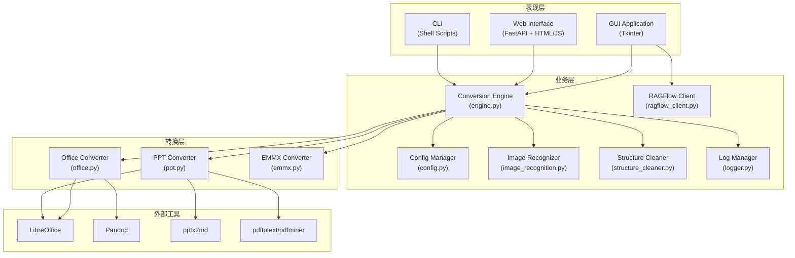

# Design Document

## Overview

Everything2MD 采用模块化分层架构设计，核心由 Python 实现，保留 Shell 脚本作为遗留接口。系统分为三层：
1. **表现层**：GUI（Tkinter）、Web（FastAPI + 前端）、CLI（Shell脚本）
2. **业务层**：转换引擎、配置管理、RAGFlow集成、增强处理
3. **转换层**：各类格式转换器、外部工具调用

## Architecture



## Components and Interfaces

### 1. ConversionEngine (engine.py)

核心转换引擎，协调整个转换流程。

```python
class ConversionEngine:
    def __init__(self, config_manager: ConfigManager)
    def detect_type(self, path: Path) -> str | None
    def convert_file(self, input_path: Path, output_path: Path, 
                     status_callback=None, context=None) -> Path | List[Path] | None
    def run(self, input_path_str, output_path_str, 
            progress_callback=None, file_converted_callback=None, 
            status_callback=None) -> None
    def stop(self) -> None
```

**职责**：
- 文件类型检测
- 转换器路由
- 批量处理调度
- 进度回调管理
- 任务取消控制

### 2. ConfigManager (config.py)

配置管理器，处理JSON格式的配置文件。

```python
class ConfigManager:
    def __init__(self, config_path=None)
    def get_default_config(self) -> dict
    def load_config(self) -> None
    def save_config(self) -> None
    def get(self, key, default=None) -> Any
    def set(self, key, value) -> None
```

**配置结构**：
```json
{
  "version": "1.0",
  "gui_settings": { "window_width", "window_height", "theme" },
  "conversion_settings": { "log_level", "output_format", "batch_processing" },
  "path_settings": { "soffice_path", "pandoc_path" },
  "ragflow_settings": { "api_base_url", "api_key" },
  "image_recognition": { "enabled", "api_base", "model" },
  "structure_cleaning": { "enabled", "api_base", "model" }
}
```

### 3. OfficeConverter (converters/office.py)

Office文档转换器。

```python
class OfficeConverter(BaseConverter):
    def convert(self, input_path: Path, output_path: Path, 
                context=None) -> Path
    def _convert_with_pandoc_direct(self, input_path, output_path, 
                                     pandoc_path, context=None)
    def _convert_html_to_md(self, html_path, output_path, 
                            pandoc_path, context=None)
```

**转换流程**：
1. 复制文件到临时目录
2. LibreOffice 转换为 HTML
3. Pandoc 转换为 Markdown
4. Lua 过滤器清理格式
5. 后处理清理残留标签

### 4. PptConverter (converters/ppt.py)

PPT/PDF转换器。

```python
class PptConverter(BaseConverter):
    def convert(self, input_path: Path, output_path: Path, 
                context=None) -> Path
    def _convert_pptx(self, input_path, output_path, context=None)
    def _convert_ppt(self, input_path, output_path, context=None)
    def _convert_pdf_to_md(self, pdf_file: Path, output_path: Path, 
                           context=None) -> Path
    def _fallback_pdf_parsing(self, pdf_file: Path, output_path: Path) -> Path
```

**转换策略**：
- PPTX: pptx2md → LibreOffice降级
- PPT: LibreOffice → PDF → Markdown
- PDF: Pandoc → pdftotext → pdfminer → 复制原文件

### 5. GUI Application (gui/main.py)

Tkinter桌面应用。

```python
class Everything2MDGUI:
    def __init__(self, root)
    def create_widgets(self)
    def init_convert_tab(self, parent)
    def init_rag_tab(self, parent)
    def init_parsing_tab(self, parent)
    def start_conversion(self)
    def cancel_conversion(self)
    def load_config(self)
    def save_config(self)
```

**界面结构**：
- Tab 1: 转换控制（输入输出、配置、进度、日志）
- Tab 2: 分发中心（RAGFlow集成）
- Tab 3: 解析增强（图片识别、结构清洗）

### 6. Web Backend (web/backend/main.py)

FastAPI Web服务。

```python
# API Endpoints
GET  /api/config          # 获取配置
POST /api/config          # 更新配置
GET  /api/fs/list         # 文件系统浏览
POST /api/convert         # 启动转换任务
WS   /ws/logs             # 日志WebSocket
```

### 7. RAGFlowClient (ragflow_client.py)

RAGFlow知识库客户端。

```python
class RAGFlowClient:
    def __init__(self, api_base, api_key)
    def list_datasets(self) -> List[dict]
    def upload_file(self, dataset_id, file_path) -> dict
```

### 8. ImageRecognizer (image_recognition.py)

图片识别模块。

```python
class ImageRecognizer:
    def __init__(self, config_manager: ConfigManager)
    def process_markdown(self, md_path: Path, source_path: Path = None)
    def recognize_image(self, image_path: Path, context: str = "") -> str
```

### 9. StructureCleaner (structure_cleaner.py)

结构化清洗模块。

```python
class StructureCleaner:
    def __init__(self, config_manager: ConfigManager)
    def clean_markdown(self, md_path: Path)
```

## Data Models

### 配置数据模型

```python
@dataclass
class ConversionSettings:
    log_level: str = "INFO"
    output_format: str = "markdown"
    max_output_file_size_mb: int = 20
    batch_enabled: bool = True
    max_parallel_jobs: int = 2
    file_filters: List[str] = field(default_factory=lambda: ["docx", "pptx", "pdf", "txt"])

@dataclass
class PathSettings:
    last_input_path: str = ""
    last_output_path: str = ""
    soffice_path: str = ""
    pandoc_path: str = ""

@dataclass
class RAGFlowSettings:
    api_base_url: str = ""
    api_key: str = ""

@dataclass
class ImageRecognitionSettings:
    enabled: bool = False
    api_base: str = "https://api.openai.com/v1"
    api_key: str = ""
    model: str = "gpt-4-vision-preview"
    max_concurrency: int = 2
    context_length: int = 500
```

### 文件状态模型

```python
@dataclass
class FileStatus:
    path: str
    status: str  # "processing", "success", "failed", "skipped", "cancelled"
    message: str
```

## Correctness Properties

*A property is a characteristic or behavior that should hold true across all valid executions of a system-essentially, a formal statement about what the system should do. Properties serve as the bridge between human-readable specifications and machine-verifiable correctness guarantees.*

### Property 1: 文件类型检测一致性

*For any* 有效的文件路径，`detect_type()` 方法应根据文件扩展名返回正确的类型标识符，且对同一文件多次调用应返回相同结果。

**Validates: Requirements 1.1-1.7**

### Property 2: 配置持久化往返一致性

*For any* 有效的配置对象，执行 `save_config()` 后再 `load_config()`，应得到等价的配置数据。

**Validates: Requirements 3.1, 3.5**

### Property 3: 批量处理文件过滤正确性

*For any* 输入目录和文件过滤器配置，`run()` 方法处理的文件集合应精确匹配过滤器指定的扩展名。

**Validates: Requirements 2.1, 2.5**

### Property 4: 转换输出存在性

*For any* 成功的转换操作，输出路径应存在有效的文件，且文件大小大于0。

**Validates: Requirements 1.1-1.7**

### Property 5: 任务取消响应性

*For any* 正在进行的转换任务，调用 `stop()` 后，所有活动子进程应被终止，且不应有新的转换开始。

**Validates: Requirements 11.1-11.3**

### Property 6: 日志级别过滤正确性

*For any* 配置的日志级别，低于该级别的日志消息不应被输出。

**Validates: Requirements 10.1**

### Property 7: 大文件分割完整性

*For any* 超过大小限制的输出文件，分割后的所有文件内容合并应等于原始内容。

**Validates: Requirements 9.1-9.3**

### Property 8: 并行任务数限制

*For any* 批量转换操作，同时运行的转换任务数不应超过配置的 `max_parallel_jobs`。

**Validates: Requirements 2.2**

## Error Handling

### 转换错误处理

1. **文件不存在**：记录错误日志，返回失败状态
2. **不支持的格式**：记录警告日志，跳过文件
3. **外部工具失败**：重试最多3次，记录详细错误信息
4. **权限错误**：重试最多5次（文件占用），记录错误
5. **超时**：终止子进程，记录超时错误

### 配置错误处理

1. **配置文件损坏**：备份原文件，重置为默认配置
2. **配置项缺失**：使用默认值
3. **类型错误**：尝试类型转换，失败则使用默认值

### 网络错误处理

1. **RAGFlow连接失败**：显示错误信息，允许重试
2. **LLM API失败**：记录警告，跳过增强处理

## Testing Strategy

### 单元测试

使用 `pytest` 框架，覆盖：
- ConfigManager 的配置读写
- 文件类型检测逻辑
- 工具路径检测
- 文件哈希计算
- 版本文件名解析

### 集成测试

- 端到端转换流程测试
- Web API 测试
- RAGFlow 集成测试（需要真实服务）

### Property-Based Testing

使用 `hypothesis` 库：
- 配置往返测试
- 文件过滤器测试
- 大文件分割测试

### UI测试

使用 `pytest` + Tkinter测试：
- GUI启动测试
- 基本交互测试

### Shell脚本测试

使用 `bats` 框架：
- 参数解析测试
- 日志模块测试
- 格式转换测试
