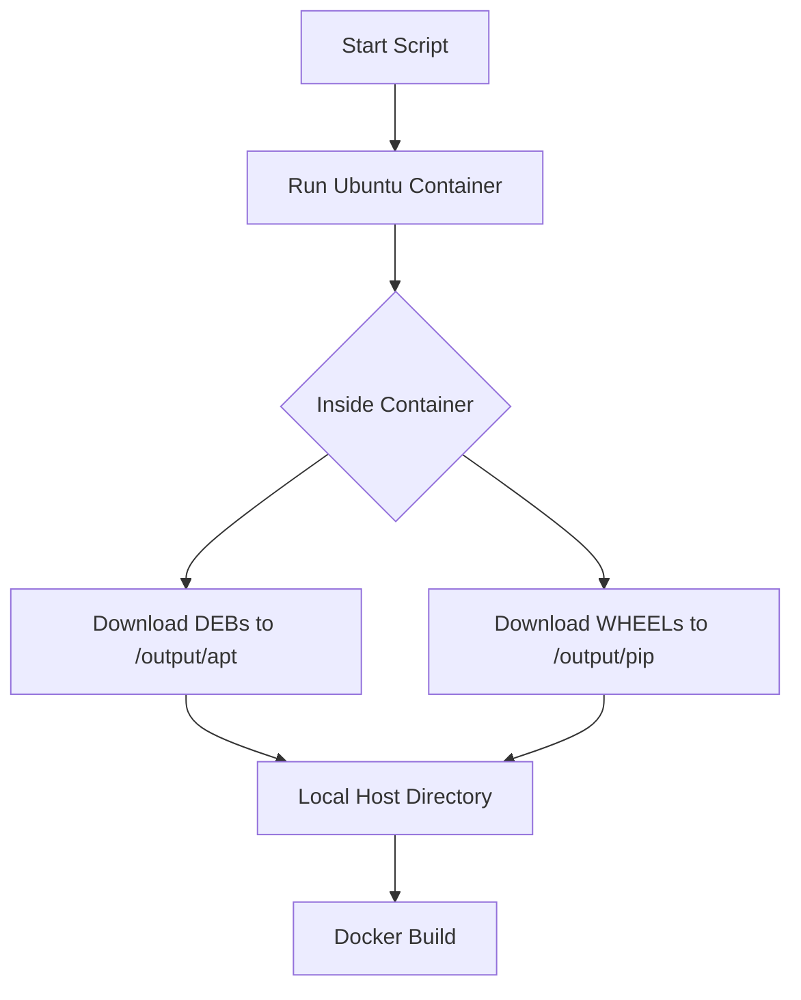

# DESIGN_Docker资源本地缓存

## 1. 下载脚本设计 (`prepare_offline_resources.ps1`)
### 逻辑流程
1. 创建本地目录 `docker_resources/apt` 和 `docker_resources/pip`。
2. 启动 Docker 容器 (Ubuntu 22.04)，挂载本地目录。
3. **容器内操作**:
   - 配置阿里云镜像源。
   - `apt-get update`。
   - `apt-get install --download-only -y [列表...]`。
   - 将 `/var/cache/apt/archives/*.deb` 复制到挂载的 `/output/apt`。
   - 安装 `pip` 和 `venv`。
   - `pip download -d /output/pip pptx2md -r requirements.txt`。
4. 脚本结束，提示用户。

## 2. Dockerfile 重构设计
### 阶段划分
```dockerfile
FROM ubuntu:22.04

# 1. 基础设置与源 (保留源配置以防万一，但优先本地)
COPY docker_resources/apt /tmp/apt
RUN cd /tmp/apt && dpkg -i *.deb || (apt-get update && apt-get -f install -y)

# ... 配置时区 ...

# 2. Python 依赖
COPY docker_resources/pip /tmp/pip
COPY requirements.txt /tmp/requirements.txt
RUN pip install --no-index --find-links=/tmp/pip pptx2md -r /tmp/requirements.txt
```

## 3. 风险与应对
- **依赖冲突**: `dpkg -i *.deb` 可能会因为顺序问题失败。
  - **对策**: 使用 `apt-get install /tmp/apt/*.deb` (支持本地路径解析依赖)。
- **LibreOffice 依赖**: 非常多。
  - **对策**: 确保下载时包含 Recommends 或手动验证。

## 4. 模块依赖图

