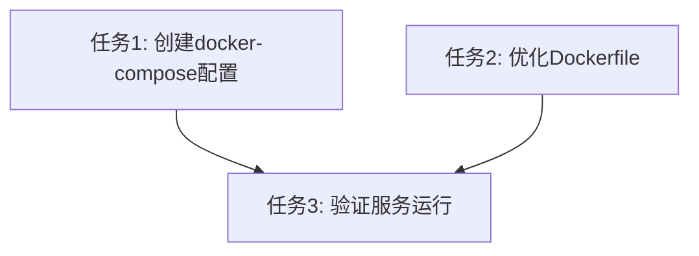

# Docker服务化任务分解

## 原子任务列表

### 任务1: 创建docker-compose配置
- 输入契约：
  - 前置依赖：无
  - 输入数据：Dockerfile
- 输出契约：
  - 输出数据：docker-compose.yml
  - 交付物：可运行的docker服务配置
- 实现约束：
  - 技术栈：Docker Compose
  - 接口规范：挂载/work目录，映射输入输出目录
  - 质量要求：服务可启动，环境配置正确

### 任务2: 优化Dockerfile符合规范
- 输入契约：
  - 前置依赖：无
  - 输入数据：Dockerfile
- 输出契约：
  - 输出数据：Dockerfile
  - 交付物：符合用户规则的Dockerfile
  - 验收标准：包含venv，使用国内镜像，设置时区和UTF-8
- 实现约束：
  - 技术栈：Docker
  - 质量要求：构建成功，环境合规

### 任务3: 验证服务运行
- 输入契约：
  - 前置依赖：任务1, 2完成
  - 输入数据：docker-compose.yml
- 输出契约：
  - 输出数据：服务运行状态
  - 交付物：运行中的容器
  - 验收标准：容器启动成功，能执行转换命令
- 实现约束：
  - 技术栈：Docker CLI
  - 质量要求：功能正常

## 任务依赖图

