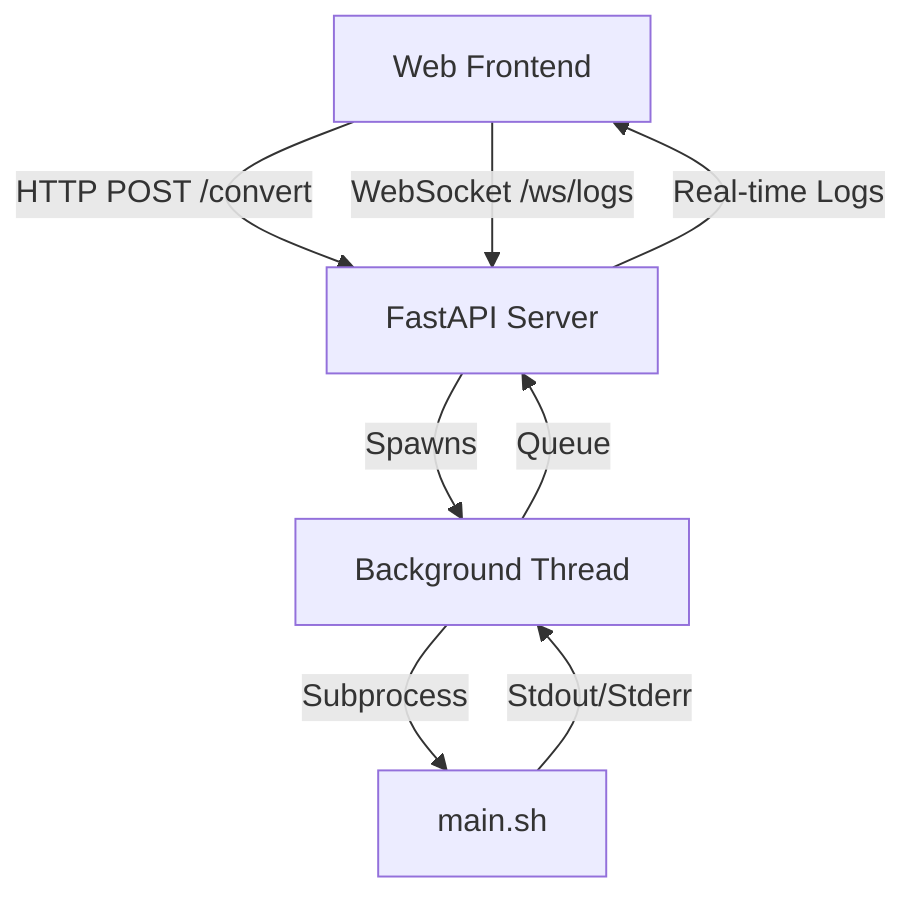

# Web界面增强 - 架构设计 (Design)

## 1. 系统架构图 (Mermaid)

## 2. 模块设计

### 2.1 后端 (Backend)
- **LogManager**: 单例类，管理全局日志队列和当前任务状态。
  - `start_task(cmd, env)`: 启动新线程运行子进程。
  - `stop_task()`: 终止当前子进程。
  - `get_log_generator()`: 异步生成器，供 WebSocket 消费。
- **WebSocket Endpoint**:
  - 建立连接后，循环读取 `LogManager` 的队列并发送给客户端。

### 2.2 前端 (Frontend)
- **TerminalComponent**:
  - 维护 WebSocket 连接。
  - 接收消息并追加到 DOM。
  - 支持自动滚动。
  - 处理连接断开和错误重连。

## 3. 接口定义
- **WS /ws/logs**:
  - Protocol: Text frames.
  - Messages: Raw log lines.
  - Close: Task finished.

## 4. 异常处理
- 如果 WebSocket 断开，后端任务继续运行（日志可能丢失，或保留在缓冲区）。
- 如果后端崩溃，前端应提示连接错误。
