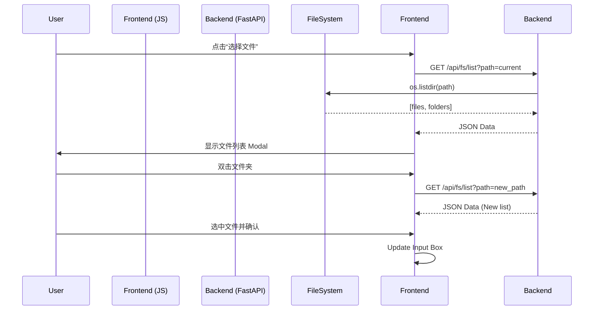

# 设计文档：Web端文件选择器适配

## 1. 架构设计
采用前后端分离模式，后端负责文件系统操作，前端负责 UI 展示。



## 2. 接口设计
### `GET /api/fs/list`
- **Query Params**:
  - `path`: string (Target directory path). If empty, defaults to `os.getcwd()`.
  - `only_dir`: bool (If true, filters out files. For directory selection mode).
- **Response**:
  ```json
  {
    "path": "/absolute/path/to/current",
    "parent": "/absolute/path/to/parent", // null if root
    "folders": ["subfolder1", "subfolder2"],
    "files": ["file1.txt", "file2.doc"]
  }
  ```

## 3. UI 设计
- **Modal**: 使用 CSS Flexbox/Grid 布局。
- **List Item**: 图标 (文件夹/文件) + 名称。
- **Navigation**: 顶部显示面包屑或当前路径输入框（可编辑跳转）。

## 4. 安全性
- 简单实现暂不包含 `..` 路径遍历攻击防御（因为本工具定位为本地单机工具，用户有权访问文件系统）。
- 但建议在 API 层面对路径进行 `os.path.abspath` 规范化。
