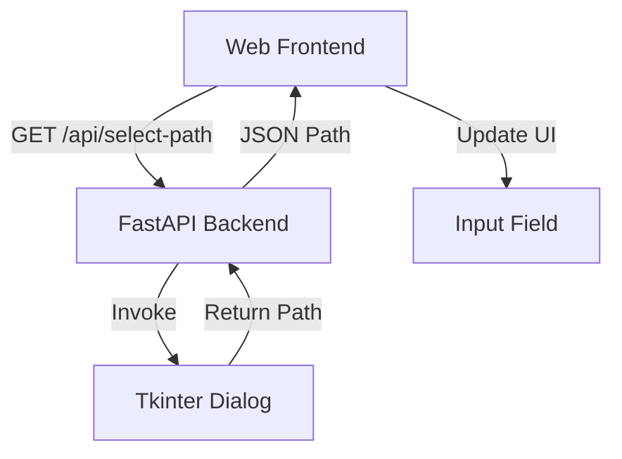

# DESIGN: 界面优化_中文及原生文件选择

## 1. 系统架构图

## 2. 模块设计

### 2.1 后端 (main.py)
*   **依赖**：`tkinter` (标准库)。
*   **接口**：
    *   `GET /api/system/select-path`
    *   参数：`type` (枚举: `file`, `directory`)
    *   返回：`{"path": "C:/Abs/Path/To/File"}` 或 `{"path": ""}` (取消)
*   **实现细节**：
    *   使用 `tkinter.Tk()` 创建隐藏主窗口。
    *   `withdraw()` 隐藏主窗口。
    *   `wm_attributes('-topmost', 1)` 确保弹窗在最前。
    *   `filedialog.askopenfilename()` 或 `askdirectory()`。
    *   注意要在非主线程运行可能需要 `run_in_executor`，但在 FastAPI 简单使用中直接调用通常可行（会阻塞当前 worker），对于单用户工具可接受。

### 2.2 前端 (HTML/JS)
*   **UI 变更**：
    *   翻译：Title, Labels, Options, Buttons, Logs -> 中文。
    *   移除：`
` 及其相关 CSS/JS。
*   **逻辑变更**：
    *   `openFilePicker(target)` 重写为调用后端 API。
    *   `target` 映射：
        *   `input` -> `type=file` (或根据逻辑支持文件夹，目前工具支持输入为文件夹，所以需让用户选择是文件还是文件夹，或者提供两个按钮？)
        *   *修正*：原输入支持文件或文件夹。原生对话框通常区分。
        *   *方案*：给输入框旁提供两个按钮或下拉？或者默认提供“选择文件”和“选择文件夹”两个按钮。
        *   *简化方案*：点击“浏览”时，弹出一个小的浏览器原生 `confirm` 或自定义简单的 JS 弹窗问“选择文件还是文件夹？”，或者在界面上直接放两个图标按钮：📄(文件) 📂(文件夹)。
        *   *决定*：为了界面简洁，输入框旁放两个小按钮，或一个 Split Button。
        *   *最简易用*：将 "Browse" 拆分为 "选文件" 和 "选目录" 两个链接/按钮。

## 3. 数据流
1. 用户点击“选择文件”。
2. JS 请求 `/api/system/select-path?type=file`。
3. Python 弹出窗口。
4. 用户选择 `D:\docs\report.docx`。
5. Python 返回 `{"path": "D:\\docs\\report.docx"}`。
6. JS 更新输入框 value。

## 4. 异常处理
*   用户取消选择：返回空字符串或 null，前端不更新。
*   后端缺少 tkinter：捕获 ImportError，返回 500，前端提示“无法调用系统组件”。
