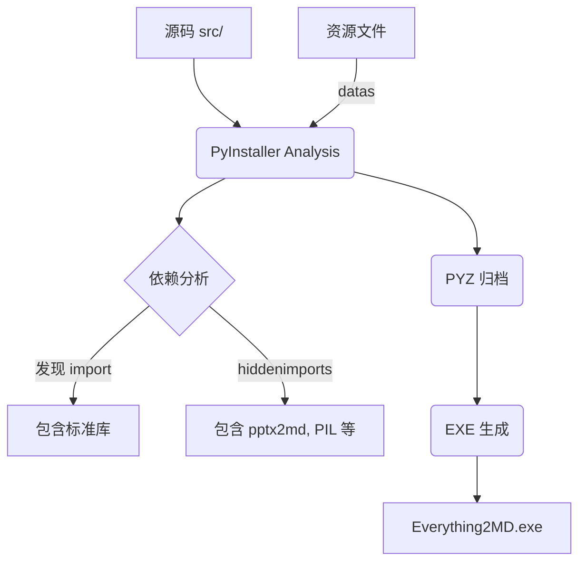

# DESIGN_打包发布

## 1. 构建架构
使用 PyInstaller 进行打包。



## 2. Spec 文件修改计划
需要修改 `Everything2MD.spec` 的 `Analysis` 部分：

```python
hiddenimports=[
    'pptx2md', 
    'pptx2md.parser', 
    'pptx2md.outputter', 
    'pptx2md.entry',  # 新增
    'pptx2md.types',  # 新增
    'pptx', 
    'PIL'
],
```

## 3. 验证计划
1.  **执行打包**: 运行 `pyinstaller Everything2MD.spec --clean`。
2.  **启动测试**: 运行生成的 EXE，检查是否能启动 GUI。
3.  **功能测试**: 拖入一个 PPTX 文件，验证是否触发 `pptx2md` 逻辑（或者至少不报 `ImportError`）。
