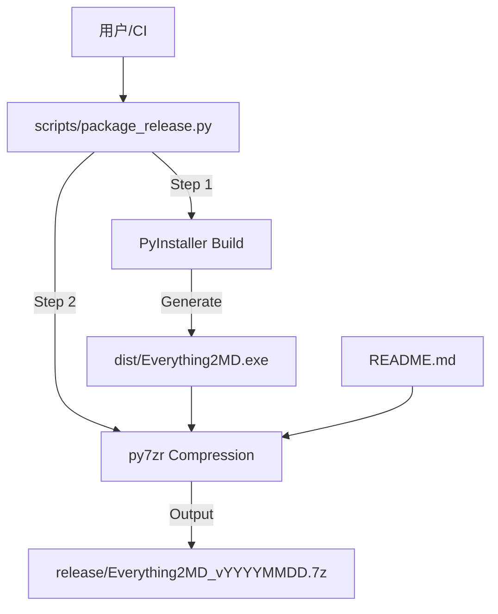

# DESIGN_打包发布

## 1. 系统架构
本模块不涉及修改核心业务逻辑，而是新增一个构建脚本，用于自动化打包流程。

## 2. 详细设计

### 2.1 构建脚本 (`scripts/package_release.py`)
-   **输入**: 无（自动读取当前目录配置）。
-   **逻辑**:
    1.  **环境检查**: 检查是否安装 `py7zr`，若无则尝试 `pip install py7zr`。
    2.  **清理**: 清理 `build/` 和 `dist/` 目录（可选，`--clean` 参数）。
    3.  **构建**: 执行 `pyinstaller Everything2MD.spec --clean --noconfirm`。
    4.  **验证**: 检查 `dist/Everything2MD.exe` 是否存在。
    5.  **打包**:
        -   目标目录: `release/`
        -   文件名: `Everything2MD_{YYYYMMDD}.7z`
        -   内容: `dist/Everything2MD.exe` (重命名为 `Everything2MD.exe`), `README.md`。
    6.  **输出**: 打印最终文件路径。

### 2.2 依赖管理
-   构建脚本独立管理 `py7zr` 依赖，不强制加入项目 `requirements.txt`，但建议在开发文档中说明。

## 3. 接口规范
-   CLI 命令: `python scripts/package_release.py`
