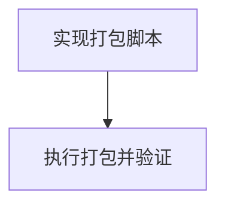

# TASK_打包发布

## 任务清单

### Task 1: 实现打包脚本
-   **输入**: `Everything2MD.spec`, `README.md`
-   **输出**: `scripts/package_release.py`
-   **描述**: 编写 Python 脚本，自动安装 `py7zr`，调用 PyInstaller，然后将 exe 和 readme 打包成 7z。
-   **验收标准**: 脚本代码无语法错误，逻辑清晰，包含必要的错误处理。

### Task 2: 执行打包并验证
-   **输入**: `scripts/package_release.py`
-   **输出**: `release/*.7z`
-   **描述**: 在终端运行脚本，观察输出日志，检查生成的 7z 文件内容。
-   **验收标准**:
    -   脚本运行成功，无报错。
    -   `release/` 目录下生成了带日期的 7z 文件。
    -   解压 7z 文件，包含 `Everything2MD.exe` 和 `README.md`。
    -   运行 exe 能启动 GUI。
