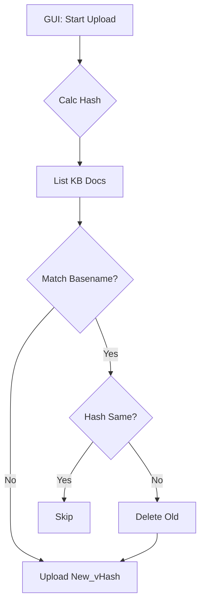

# DESIGN: 文件重复校验与版本管理

## 1. 系统架构
本功能涉及三个主要模块的修改：
1.  **Core Utils (`src/core/utils.py`)**: 提供基础哈希计算能力。
2.  **RAGFlow Client (`src/core/ragflow_client.py`)**: 封装知识库文档删除接口。
3.  **GUI Logic (`src/gui/main.py`)**: 编排上传、校验、删除、重命名流程。



## 2. 接口设计

### 2.1 `src/core/utils.py`
```python
def calculate_file_hash(filepath: str, length: int = 8) -> str:
    """
    计算文件 MD5 哈希并返回前 length 位。
    Args:
        filepath: 文件绝对路径
        length: 哈希截取长度，默认 8
    Returns:
        Hex string
    """
```

### 2.2 `src/core/ragflow_client.py`
```python
def delete_documents(self, dataset_id: str, ids: list[str]):
    """
    批量删除知识库文档。
    Args:
        dataset_id: 知识库 ID
        ids: 文档 ID 列表
    """
```

### 2.3 `src/gui/main.py`
内部辅助方法：
```python
def _parse_versioned_filename(self, filename: str) -> tuple[str, str]:
    """
    解析文件名，分离基础名和版本哈希。
    Returns: (basename, hash)
    """
```

## 3. 数据流设计
1.  **Local File** -> `utils.calculate_file_hash` -> **Hash String**
2.  **RAGFlow API** -> `list_documents` -> **Doc List (id, name)**
3.  **Logic** -> Compare (Local Name + Hash) vs (Remote Names)
4.  **Logic** -> Identify `ids_to_delete`
5.  **RAGFlow API** -> `delete_documents(ids_to_delete)`
6.  **RAGFlow API** -> `upload_file(name=basename_vHash)`

## 4. 异常处理
- **哈希计算失败**: 文件被占用或无权限 -> 记录日志，跳过该文件。
- **删除失败**: API 报错 -> 记录错误，尝试继续上传新文件（由用户后续手动清理）。
- **上传失败**: 网络中断 -> 保持原状（旧文件已被删除可能是个风险，但在覆盖更新场景下可接受）。
