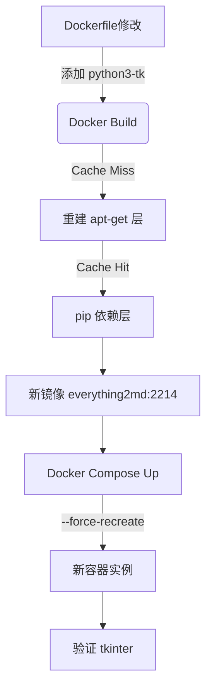

# 设计文档：Docker镜像构建修复

## 1. 架构图

## 2. 关键流程
1. **构建阶段**：
   - 执行 `docker compose build`。
   - 预期：Docker 检测到 `RUN ... apt-get install ...`指令变化，Invalidate 该层缓存，重新下载安装所有 apt 包（包括 python3-tk）。
   - 预期：后续 `COPY requirements.txt` 等层如果未变，可能使用缓存（但因为前置层变了，后续层通常也会重建，除非使用多阶段构建或特殊缓存挂载）。
   - 注意：由于 `apt-get` 层变了，基于它的后续层都会重建。这是 Docker 的标准行为。所以 "更新缓存" 实际上就是 "重建失效的层"。

2. **运行阶段**：
   - 执行 `docker compose up -d --force-recreate`。
   - 确保容器使用新 ID。

3. **验证阶段**：
   - `docker exec everything2md python3 -c "import tkinter; print('ok')"`

## 3. 异常处理
- 如果构建极慢：检查网络和镜像源。
- 如果构建报错：检查 `apt-get` 源有效性。
