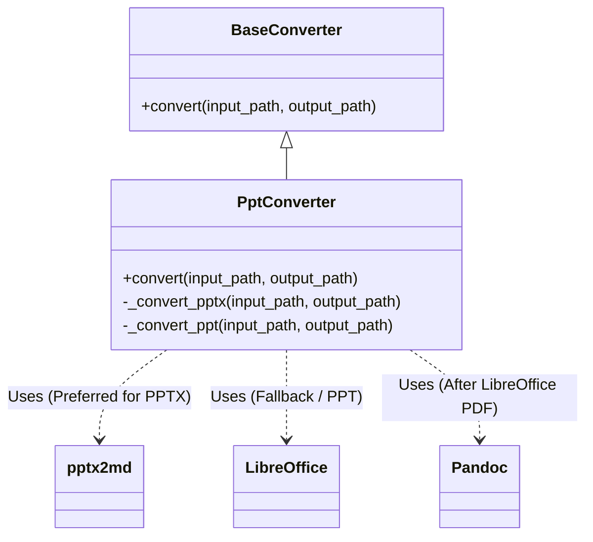

# DESIGN_PPT转换修复

## 1. 整体架构
保持现有架构不变，仅增强 `PptConverter` 组件的健壮性和依赖管理。



## 2. 模块设计

### 2.1 依赖更新
- `requirements.txt`:
  ```text
  pptx2md>=2.0.0
  python-pptx>=0.6.18
  ```

### 2.2 PptConverter 逻辑优化 (`src/core/converters/ppt.py`)
- **导入检查**: 优化 `try-except ImportError` 块，确保在导入失败时不仅记录日志，还能正确触发降级或报错。
- **调用方式**: 优先使用 Python API 调用 `pptx2md`，若 API 不匹配（版本差异），回退到 `subprocess` 调用命令行。
- **异常处理**: 捕获 `pptx2md` 执行过程中的异常，确保不会导致主进程崩溃，而是记录错误并尝试降级（如果是 PPTX）。

## 3. 接口规范
无接口变更。

## 4. 数据流向
1.  用户输入 PPT/PPTX 文件。
2.  `FileDetector` 识别类型。
3.  `PptConverter` 接收文件。
4.  若是 PPTX -> 尝试 `pptx2md` -> 成功则输出 MD。
5.  若是 PPT 或 `pptx2md` 失败 -> 调用 LibreOffice 转 PDF -> 调用 Pandoc 转 MD。
