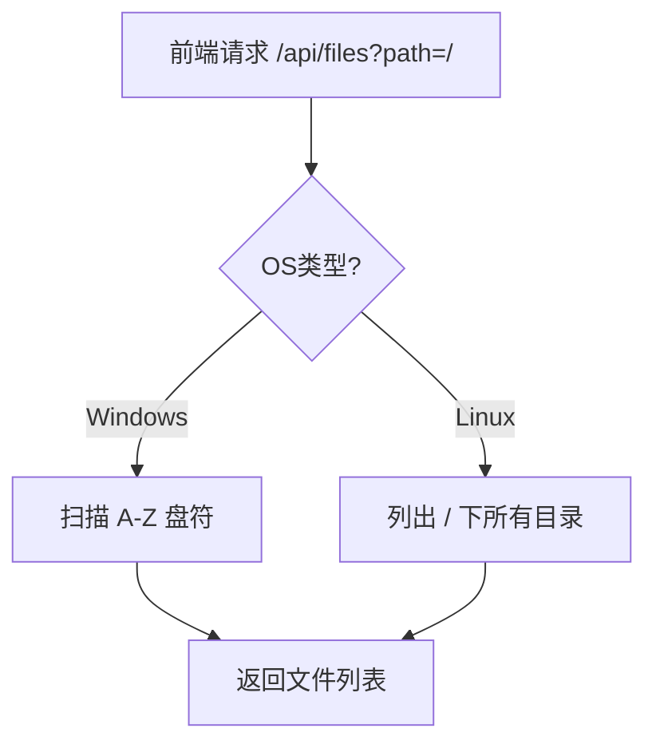

# DESIGN_修复文件选择组件

## 1. 模块修改
### 1.1 `web/backend/main.py`
#### `list_files` 函数
- **输入**: `path` (str)
- **逻辑**:
  - 判断当前 OS。
  - **Windows**: 保持原有逻辑，当 path 为 `/` 时列出驱动器。
  - **Linux/Posix**: 当 path 为 `/` 时，直接调用 `Path("/").iterdir()` 列出内容。

#### `convert` 函数 (及 `run_conversion_task`)
- **逻辑**:
  - **Windows**: 保持原有逻辑，搜索 git bash。
  - **Linux**: 直接设为 `bash`。

## 2. 流程图

