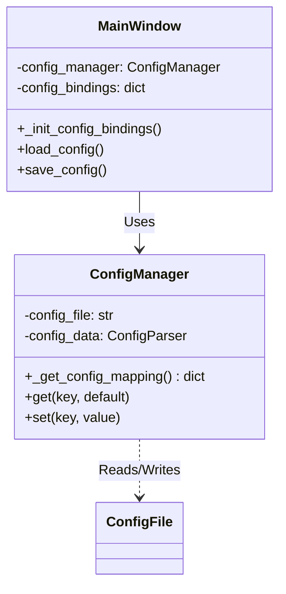

# DESIGN_配置系统重构

## 1. 系统架构设计

本次重构主要涉及 `ConfigManager`（核心配置逻辑）和 `MainWindow`（GUI 交互逻辑）两个组件。



## 2. 模块详细设计

### 2.1 ConfigManager (src/core/config.py)

#### 核心映射表 (`_get_config_mapping`)
该方法是配置系统的“真理来源（Source of Truth）”，定义了扁平化的业务键（Key）如何映射到嵌套的 INI 结构。

```python
{
    "api_key": (("llm",), "api_key"),
    "model": (("llm",), "model"),
    "struct_clean_enabled": (("structure_cleaning",), "enabled"),
    # ...
}
```

#### 通用读写逻辑
- **Get**: `Mapping[Key] -> Path`. Traverse `config_data` using `Path`. Return value or default.
- **Set**: `Mapping[Key] -> Path`. Ensure `Section` exists. Set `Option = Value`. Write to file.

### 2.2 MainWindow (src/gui/main.py)

#### 绑定机制 (`_init_config_bindings`)
该方法将 UI 状态与配置键关联起来。

```python
self.config_bindings = {
    "api_key": (self.api_key_entry_var, ""),
    "struct_clean_enabled": (self.struct_clean_enabled_var, False),
    # ...
}
```

#### 自动化加载与保存
- **Load**: Iterate `config_bindings`. Call `ConfigManager.get(key)`. Set `Var`.
- **Save**: Iterate `config_bindings`. Get `Var`. Call `ConfigManager.set(key, value)`.

## 3. 接口契约

### ConfigManager.get
- **Input**: `key` (str), `default` (Any)
- **Output**: `value` (Any) - 自动处理 boolean 字符串转换 ("true" -> True)。

### ConfigManager.set
- **Input**: `key` (str), `value` (Any)
- **Output**: None
- **Effect**: Updates `config.ini` immediately.

## 4. 异常处理
- 如果 `key` 不在映射表中，`get` 返回 `default`，`set` 记录警告日志并忽略。
- 文件读写错误由 `ConfigParser` 处理，需确保文件权限正常。
