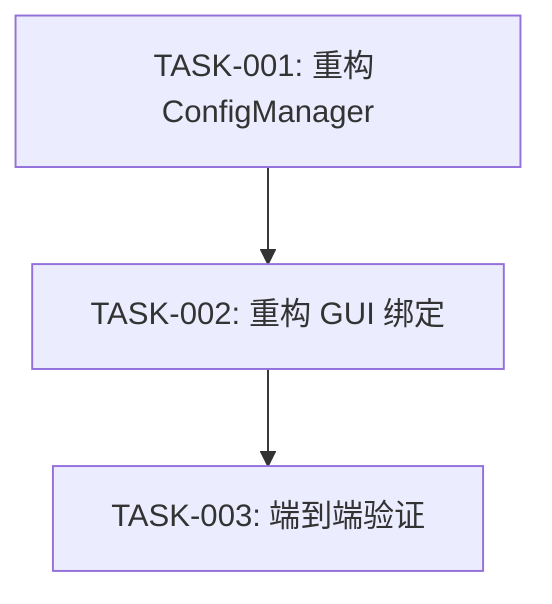

# TASK_配置系统重构

## 任务依赖图

## 任务列表

### TASK-001: 重构 ConfigManager
- **目标**: 消除 `src/core/config.py` 中的 `if/else` 逻辑。
- **输入**: 现有的 `config.py`。
- **输出**: 更新后的 `config.py`，包含 `_get_config_mapping` 方法。
- **验收标准**:
  - `get` 和 `set` 方法代码行数显著减少。
  - 所有现有配置项（API, Model, Paths）都在映射表中。
  - 单元测试（或手动测试）通过。

### TASK-002: 重构 GUI 绑定
- **目标**: 实现 GUI 配置的自动化加载与保存。
- **输入**: 现有的 `src/gui/main.py`。
- **输出**: 更新后的 `main.py`，包含 `_init_config_bindings`。
- **验收标准**:
  - `load_config` 和 `save_config` 不再包含具体的配置项逻辑。
  - 结构化清洗配置（`struct_clean_*`）包含在绑定中。
  - 自动检测逻辑（Soffice/Pandoc）保留并正确工作。

### TASK-003: 端到端验证
- **目标**: 验证配置持久化功能。
- **输入**: 运行中的应用程序。
- **输出**: 验证报告。
- **验收标准**:
  - 修改任意配置 -> 重启 -> 配置保留。
  - 验证旧配置文件兼容性。
