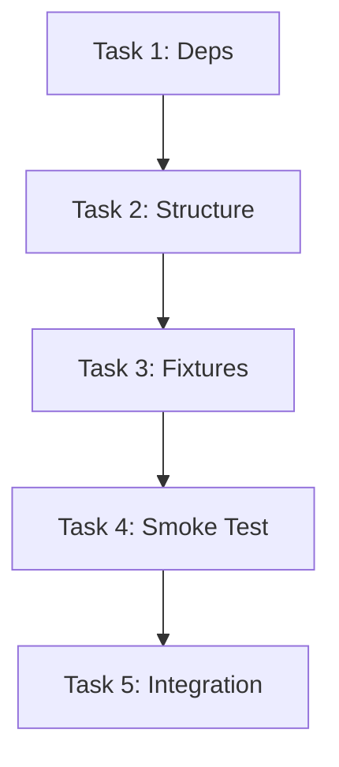

# TASK_UI自动化测试

## 1. 任务清单

### Task 1: 环境准备与依赖管理
- **目标**: 安装 `pywinauto` 并更新项目依赖配置。
- **输入**: `requirements.txt`
- **输出**: 更新后的 `requirements.txt`, 虚拟环境中安装好的包。
- **验证**: `pip freeze | grep pywinauto`

### Task 2: 建立测试目录结构与配置
- **目标**: 创建 `test/ui` 目录，配置 `pytest.ini` (注册 markers)。
- **输入**: 现有项目结构。
- **输出**: `test/ui/conftest.py`, `pytest.ini` 更新。
- **验证**: `pytest --markers` 显示 `ui` 标记。

### Task 3: 实现基础 Fixture
- **目标**: 编写 `conftest.py` 中的 `app_start` 和 `app_connect` 逻辑。
- **输入**: `src/gui/main.py` 路径。
- **输出**: 可复用的 `main_window` fixture。
- **验证**: 编写一个空测试，能够启动并关闭应用。

### Task 4: 编写启动与冒烟测试
- **目标**: 验证应用能启动，且关键控件（输入框、按钮）存在。
- **输入**: `main_window` fixture。
- **输出**: `test/ui/test_launch.py`。
- **验证**: `pytest test/ui/test_launch.py` 通过。

### Task 5: 集成到测试运行脚本
- **目标**: 更新 `run_tests.ps1` 和 `Makefile`。
- **输入**: 现有脚本。
- **输出**: 支持 `make test-ui` 或 `.\run_tests.ps1 test-ui`。
- **验证**: 运行脚本能触发 UI 测试。

## 2. 依赖关系图

