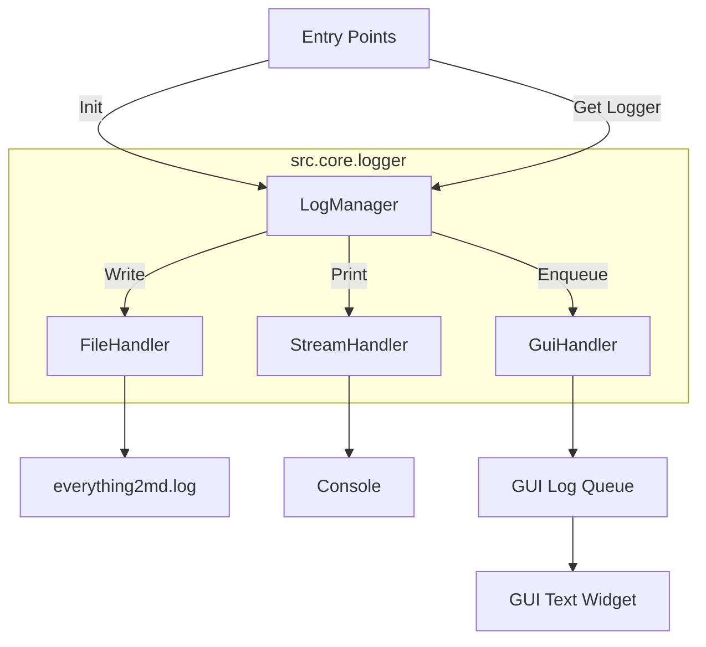

# DESIGN_日志系统

## 1. 整体架构

日志系统将作为项目的核心基础设施层 (Infrastructure Layer)，位于 `src.core` 包中。所有上层模块 (GUI, CLI, Logic) 均依赖此模块。



## 2. 模块设计

### 2.1 `src.core.logger` 模块

#### 类: `GuiLogHandler`
继承自 `logging.Handler`。
*   **属性**:
    *   `queue`: `queue.Queue`，用于线程安全地传递日志到 GUI 主线程。
*   **方法**:
    *   `emit(record)`: 将 `record` 格式化后 put 到 `queue` 中。

#### 类: `LogManager` (Singleton or Module Level)
负责配置和管理 Logger。
*   **方法**:
    *   `setup(log_level, gui_queue=None)`:
        *   确定日志文件路径 (Exe Dir vs Root Dir)。
        *   配置 `RotatingFileHandler`。
        *   配置 `StreamHandler` (Console)。
        *   如果提供了 `gui_queue`，配置 `GuiLogHandler`。
        *   设置全局异常钩子 `sys.excepthook`。
        *   打印启动 Banner 和系统信息。
    *   `get_logger(name)`: 返回 `logging.getLogger(name)`。

#### 辅助函数
*   `get_log_file_path()`: 智能判断运行环境并返回路径。
*   `log_execution_env()`: 收集并记录 OS、Python、依赖版本信息。
*   `mask_sensitive_config(config)`: 递归脱敏配置字典。

### 2.2 接口契约

#### 初始化 (在 `src/gui/main.py` 或 `cli.py` 中)
```python
from src.core.logger import LogManager
import queue

# GUI Start
log_queue = queue.Queue()
LogManager.setup(log_level="INFO", gui_queue=log_queue)

# CLI Start
LogManager.setup(log_level="DEBUG")
```

#### 使用 (在任意模块中)
```python
from src.core.logger import LogManager

logger = LogManager.get_logger(__name__)

def do_something():
    logger.info("Starting task...")
    try:
        # ...
    except Exception:
        logger.exception("Task failed")
```

## 3. 集成方案

### 3.1 GUI 集成 (`src/gui/main.py`)
1.  **移除**: 现有的 `on_log_received` 和手动构建日志字符串的逻辑。
2.  **保留**: `process_log_queue` 及其定时器，但从 queue 中取出的将是 `logging.LogRecord` 对象或已格式化的字符串。
3.  **修改**: `append_log` 方法适配新的数据结构。

### 3.2 外部命令集成 (`src/core/utils.py` / `src/core/converter.py`)
创建一个辅助函数 `run_command_with_logging` 替代直接调用 `subprocess`。

```python
def run_command_with_logging(cmd, logger, **kwargs):
    logger.info(f"Executing: {' '.join(cmd)}")
    try:
        result = subprocess.run(cmd, capture_output=True, text=True, **kwargs)
        if result.returncode != 0:
            logger.error(f"Command failed with code {result.returncode}")
            logger.error(f"Stderr: {result.stderr}")
        else:
            logger.debug(f"Stdout: {result.stdout[:1000]}...") # Truncate
        return result
    except Exception as e:
        logger.exception(f"Failed to execute command: {cmd}")
        raise
```

## 4. 异常处理策略
*   **Uncaught Exceptions**: 通过 `sys.excepthook` 捕获，确保即使 GUI 崩溃也能在日志中看到堆栈。
*   **GUI Exceptions**: Tkinter 有自己的异常处理机制 (`report_callback_exception`)，也需要挂钩。

