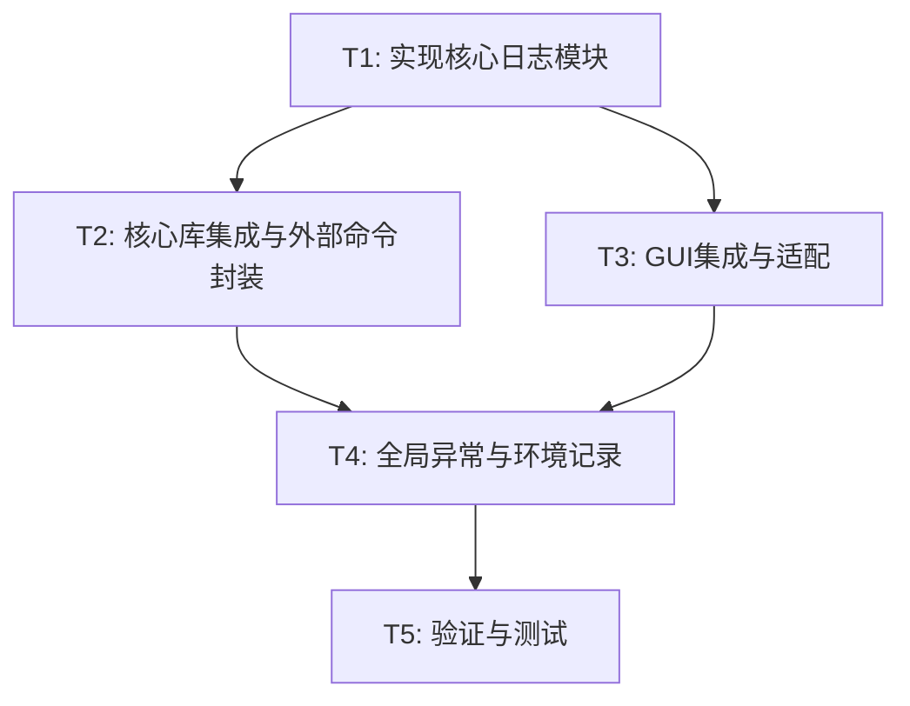

# TASK_日志系统

## 任务依赖图

## 原子任务清单

### T1: 实现核心日志模块
*   **输入**: `DESIGN_日志系统.md`
*   **输出**: `src/core/logger.py`
*   **要求**:
    *   实现 `LogManager` 类。
    *   实现 `GuiLogHandler` 类。
    *   实现文件路径智能判断 (`get_log_file_path`)。
    *   配置 `RotatingFileHandler`。

### T2: 核心库集成与外部命令封装
*   **输入**: `src/core/utils.py`
*   **输出**: 修改后的 `src/core/utils.py`
*   **要求**:
    *   移除 `utils.py` 中旧的 logging 配置。
    *   使用 `LogManager.get_logger`。
    *   封装 `run_command` 函数，自动记录 subprocess 的输入输出。
    *   替换项目中所有直接使用 `subprocess` 的地方（主要在转换逻辑中）。

### T3: GUI集成与适配
*   **输入**: `src/gui/main.py`
*   **输出**: 修改后的 `src/gui/main.py`
*   **要求**:
    *   在 `__init__` 中调用 `LogManager.setup`，传入 `log_queue`。
    *   修改 `process_log_queue` 以处理 `LogRecord` 对象。
    *   移除 `on_log_received` 等旧代码。
    *   确保 GUI 显示的日志颜色正确（基于 LogLevel）。

### T4: 全局异常与环境记录
*   **输入**: `src/core/logger.py`, `src/gui/main.py`
*   **输出**: 更新的代码
*   **要求**:
    *   实现 `sys.excepthook` 钩子。
    *   实现 `tk.Tk.report_callback_exception` 钩子。
    *   在 `setup` 时自动记录 OS、Python、Config 等信息。

### T5: 验证与测试
*   **输入**: 完成的代码
*   **输出**: `tests/test_logger.py`, 运行日志文件
*   **要求**:
    *   编写单元测试验证 Logger 初始化、文件写入、轮转。
    *   运行 GUI，执行一次转换，验证日志文件生成且内容完整。
    *   验证 EXE 打包后的日志路径（模拟）。

