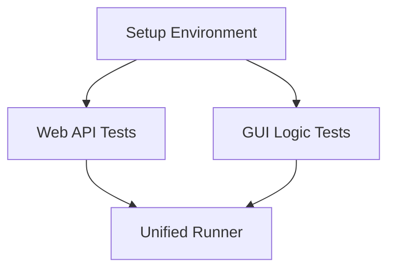

# TASK_构建测试体系

## 1. 任务分解图

## 2. 原子任务列表

### Task 1: 环境准备与依赖安装
- **输入**: `requirements.txt` (若不存在则创建)
- **输出**: 安装 `pytest`, `httpx`, `pytest-asyncio`。
- **约束**: 使用 `venv`。

### Task 2: Web 后端接口测试
- **输入**: `web/backend/main.py`
- **输出**: `test/python/test_web_api.py`
- **内容**:
  - Test `/api/config` GET (default & existing config).
  - Test `/api/config` POST (valid & invalid data).

### Task 3: GUI 逻辑测试
- **输入**: `src/gui/main.py`
- **输出**: `test/python/test_gui_logic.py`
- **内容**:
  - 提取 `Everything2MDGUI` 中不依赖 UI 的逻辑（如配置加载）进行测试，或者 Mock `tk` 对象。

### Task 4: 统一测试入口
- **输入**: Existing `Makefile` or create new script.
- **输出**: 能够一键运行 Python 和 Shell 测试。
