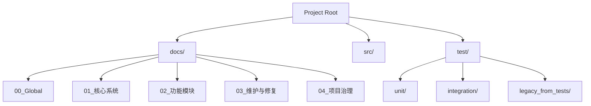

# 项目治理架构设计 (DESIGN)

## 1. 整体架构调整

### 1.1 目录结构优化

### 1.2 测试系统合并方案
*   **源目录**: `tests/` (包含 9 个 python 测试文件)
*   **目标目录**: `test/unit/legacy_from_tests/`
*   **操作步骤**:
    1.  创建目标目录。
    2.  移动文件。
    3.  运行 `pytest test/unit/legacy_from_tests/` 验证。
    4.  修复任何因路径变化导致的 Import Error (通常如果从根目录运行 pytest，import src... 应该不受影响)。
    5.  删除 `tests/` 目录。

## 2. 统一文档设计 (Project_Unified_Manual_L1_L3.md)

### 2.1 文档大纲

#### L1: 用户指南 (User Guide)
*   **项目简介**: 核心价值（任意格式转Markdown）。
*   **快速开始**:
    *   Docker 一键启动 (`docker-compose up`).
    *   本地环境搭建 (Python 3.10+, Dependencies).
*   **功能说明**:
    *   Web 界面操作流程。
    *   支持的文件格式清单 (PDF, Office, Images, etc.)。
    *   配置项说明 (`config.json`, Env Vars).
*   **常见问题 (FAQ)**.

#### L2: 系统架构 (Architecture)
*   **架构概览**:
    *   前端 (Web UI) -> 后端 (FastAPI/Flask) -> 核心引擎 (Converter Engine).
    *   外部依赖 (LibreOffice, Pandoc, Docker).
*   **核心流程**:
    *   `Upload` -> `Identify` -> `Convert` -> `Clean` -> `Download`.
*   **模块设计**:
    *   `Docker Service`: 容器化编排。
    *   `Core Engine`: 转换器工厂模式。

#### L3: 开发者指南 (Developer Guide)
*   **代码结构**: `src` 目录详解。
*   **核心接口**:
    *   `BaseConverter` 类定义。
    *   `Engine` 类定义。
*   **测试指南**: 如何运行 Bats 和 Pytest。
*   **贡献规范**: 6A 工作流说明。

## 3. 同步检查机制
*   **静态检查**: 比较 `src/` 文件列表与文档中的描述。
*   **动态检查**: 运行测试确保代码行为符合预期。

## 4. 风险控制
*   **测试破坏**: 迁移测试可能导致路径引用错误。-> **对策**: 先移动不删除，验证通过后再删除。
*   **文档过时**: 自动生成的文档可能依赖旧的元数据。 -> **对策**: 人工校对关键部分（架构图、安装命令）。
