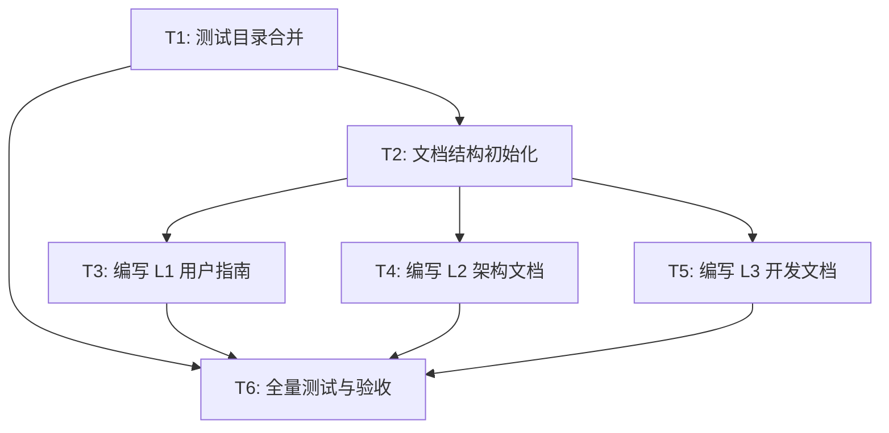

# 项目治理任务分解 (TASK)

## 任务依赖图

## 详细任务清单

### T1: 测试目录合并
*   **输入**: 存在的 `tests/` 目录。
*   **动作**:
    *   `mkdir -p test/unit/legacy_from_tests`
    *   `mv tests/* test/unit/legacy_from_tests/`
    *   `rmdir tests`
    *   `pytest test/unit/legacy_from_tests` (验证迁移后是否可用)
*   **输出**: 干净的根目录，合并后的测试集。
*   **验收**: `ls tests` 失败，`pytest` 成功。

### T2: 文档结构初始化
*   **输入**: 无。
*   **动作**:
    *   `mkdir docs/00_Global`
    *   创建 `docs/00_Global/Project_Unified_Manual_L1_L3.md` 骨架。
*   **输出**: 空白的统一文档骨架。

### T3: 编写 L1 用户指南
*   **输入**: 现有 `README.md`, `docs/01_核心系统/Align阶段/需求规格说明书.md`。
*   **动作**: 填充 L1 章节（安装、配置、使用）。
*   **输出**: 完成的 L1 部分。

### T4: 编写 L2 架构文档
*   **输入**: `docs/01_核心系统/Architect阶段/DESIGN_everything2md.md`。
*   **动作**: 填充 L2 章节（Mermaid 架构图、流程说明）。
*   **输出**: 完成的 L2 部分。

### T5: 编写 L3 开发文档
*   **输入**: `src/` 代码分析结果。
*   **动作**: 填充 L3 章节（目录树、类说明、测试指引）。
*   **输出**: 完成的 L3 部分。

### T6: 全量测试与验收
*   **输入**: 完成的代码和文档。
*   **动作**:
    *   运行 `pytest`。
    *   人工检查文档可读性。
*   **输出**: 测试报告，最终文档。
