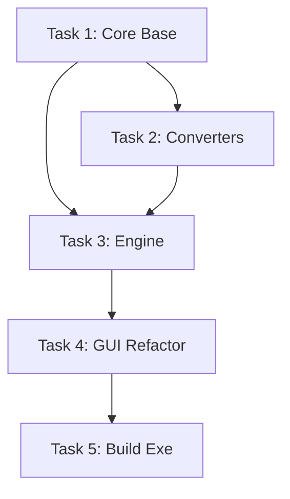

# TASK: 打包项目为exe

## 1. 任务拆解

### Task 1: 核心基础架构 (src/core)
- **目标**: 创建目录结构，实现配置管理和基础工具。
- **子任务**:
  - [ ] 创建 `src/core` 及子目录。
  - [ ] 实现 `src/core/config.py` (ConfigManager)。
  - [ ] 实现 `src/core/utils.py` (Logger, 路径检测)。

### Task 2: 转换器实现 (src/core/converters)
- **目标**: 实现具体的转换逻辑。
- **子任务**:
  - [ ] 实现 `src/core/converters/base.py` (基类)。
  - [ ] 实现 `src/core/converters/office.py` (LibreOffice 调用，含 Windows 路径探测)。
  - [ ] 实现 `src/core/converters/pandoc.py` (Pandoc 调用)。
  - [ ] 实现 `src/core/converters/ppt.py` (如有特殊逻辑)。

### Task 3: 转换引擎 (src/core/engine.py)
- **目标**: 实现任务调度和批量处理。
- **子任务**:
  - [ ] 实现 `ConversionEngine` 类。
  - [ ] 集成 `ThreadPoolExecutor` 实现并发。
  - [ ] 实现进度回调机制。

### Task 4: GUI 改造 (src/gui/main.py)
- **目标**: 移除 Shell 调用，对接 Python Core。
- **子任务**:
  - [ ] 替换 `subprocess.run(["bash", "config_manager.sh"])` 为 `ConfigManager` 调用。
  - [ ] 替换 `subprocess.Popen(["bash", "main.sh"])` 为 `ConversionEngine` 调用。
  - [ ] 修复日志显示逻辑。

### Task 5: 打包执行
- **目标**: 生成 exe 文件。
- **子任务**:
  - [ ] 编写 `build.spec` 文件。
  - [ ] 执行 `pyinstaller` 打包。
  - [ ] 验证 exe 运行。

## 2. 依赖图

