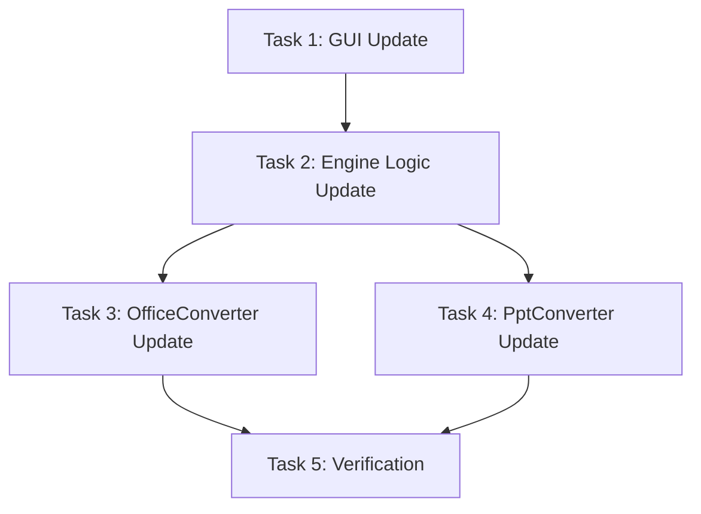

# 增加文档目标格式：PDF - Task Document

## 任务列表

### Task 1: 更新 GUI 配置支持 PDF
- **文件**: `src/gui/fixed_main_v2.py`
- **内容**:
  - 在 `validate_config` 中添加 `pdf` 到合法格式列表。
  - 在 `create_general_tab` 中添加 `pdf` 到下拉框选项。
- **验收**: 运行 GUI，能选择 PDF 并保存配置。

### Task 2: 更新 Engine 后缀生成逻辑
- **文件**: `src/core/engine.py`
- **内容**:
  - 在 `convert_directory` 或类似遍历逻辑中。
  - 读取配置中的 `output_format`。
  - 根据格式动态生成目标文件后缀（.pdf, .md, .html, .txt）。
- **验收**: 单元测试或模拟运行，确认生成的 `output_path` 后缀正确。

### Task 3: 更新 OfficeConverter 支持 PDF
- **文件**: `src/core/converters/office.py`
- **内容**:
  - 在 `convert` 方法中判断 `output_path.suffix == '.pdf'`。
  - 实现 LibreOffice 转 PDF 的分支逻辑。
- **验收**: 将 docx 转换为 pdf，文件可打开且内容正确。

### Task 4: 更新 PptConverter 支持 PDF
- **文件**: `src/core/converters/ppt.py`
- **内容**:
  - 在 `convert` 方法中判断 `output_path.suffix == '.pdf'`。
  - 如果是 PDF -> PDF，实现直接复制。
  - 如果是 PPT/PPTX -> PDF，调用 LibreOffice 转 PDF。
- **验收**: 将 pptx 转换为 pdf，将 pdf 转换为 pdf (复制)。

### Task 5: 综合验证
- **内容**:
  - 运行完整流程。
  - 输入包含 docx, pptx, pdf 的目录。
  - 设置输出格式为 PDF。
  - 检查输出目录是否生成了对应的 PDF 文件。
