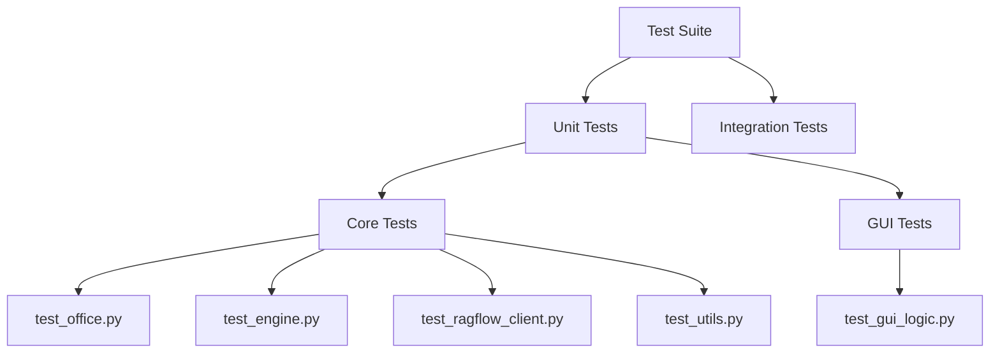

# 测试架构设计 (DESIGN)

## 1. 整体架构
采用标准的 `pytest` 测试架构。
测试代码位于 `test/` 目录下，与 `src/` 目录结构镜像对应。

## 2. 模块设计

### 2.1 Core 模块测试
- **Mock 策略**:
    - `subprocess.run/Popen`: 使用 `mocker.patch('subprocess.run')` 模拟外部命令执行结果。
    - `open/write`: 使用 `mocker.patch('builtins.open')` 或 `tmp_path` fixture。
    - `logging`: 验证日志输出。

### 2.2 RAGFlow 客户端测试
- **Mock 策略**:
    - `httpx.Client`/`httpx.AsyncClient`: Mock HTTP 请求和响应，模拟成功、失败、超时等场景。
    - 验证请求参数是否正确。

### 2.3 GUI 测试
- **策略**:
    - Mock `tkinter.Tk`, `tkinter.filedialog` 等组件。
    - 验证 ViewModel/Logic 层的状态变化。
    - 避免真实创建窗口。

### 2.4 Utils 测试
- **策略**:
    - 纯函数测试，覆盖所有边界条件（空输入、非法输入、超长输入等）。

## 3. 接口规范
- 测试函数命名: `test_<function_name>_<scenario>`
- Fixture 复用: 在 `conftest.py` 中定义通用的 Mock 对象。
