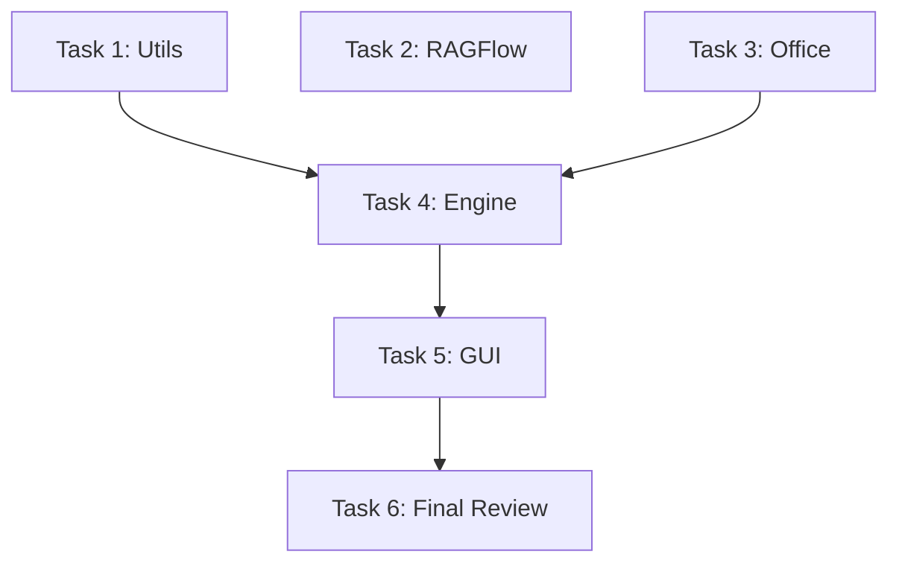

# 原子化任务清单 (TASK)

## 1. 任务拆分

### 任务 1: 补全 `src/core/utils.py` 测试
- **目标**: 覆盖率达到 100%。
- **内容**: 为所有辅助函数编写单元测试，特别是文件操作、路径处理、日志相关的函数。
- **依赖**: 无。

### 任务 2: 补全 `src/core/ragflow_client.py` 测试
- **目标**: 覆盖率达到 100%。
- **内容**: Mock 所有 HTTP 请求，测试各种 API 响应情况（包括错误码、网络异常）。
- **依赖**: 无。

### 任务 3: 补全 `src/core/converters/office.py` 测试
- **目标**: 覆盖率达到 100%。
- **内容**: Mock `subprocess` 调用，覆盖所有转换路径（LibreOffice, Pandoc 降级, 错误重试）。
- **依赖**: 无。

### 任务 4: 补全 `src/core/engine.py` 测试
- **目标**: 覆盖率达到 100%。
- **内容**: 测试 `ConversionEngine` 的各种状态，文件类型检测逻辑，批处理逻辑的异常处理。
- **依赖**: 任务 1, 3 (依赖 utils 和 converters)。

### 任务 5: 增强 `src/gui/main.py` 测试
- **目标**: 覆盖率 > 60%，覆盖主要业务逻辑。
- **内容**: 提取或 Mock GUI 组件，测试 `start_conversion`, `select_files` 等逻辑方法。
- **依赖**: 任务 4。

### 任务 6: 最终验收与修复
- **目标**: 总覆盖率 > 80%，核心 100%。
- **内容**: 运行所有测试，检查覆盖率报告，修复遗漏的行。

## 2. 依赖图

