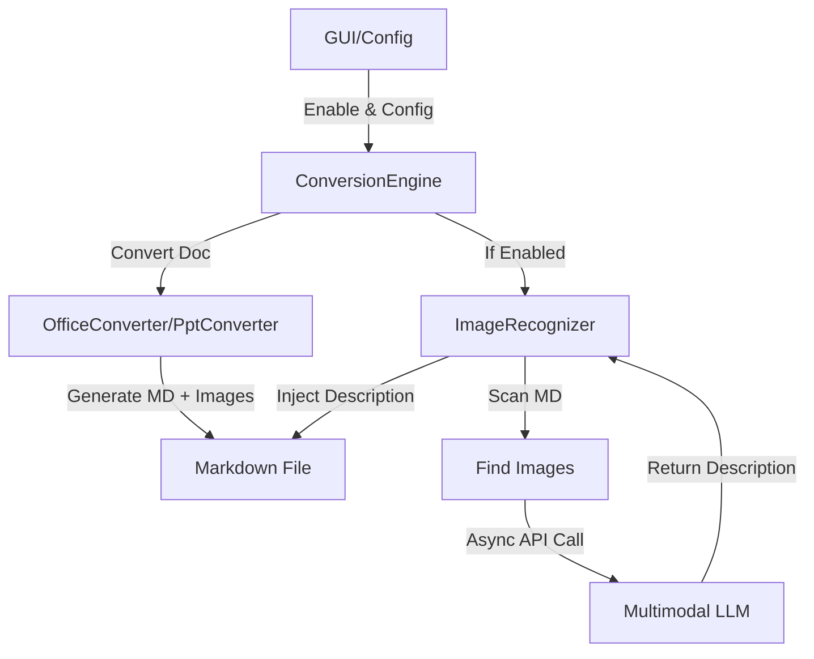

# DESIGN: Image Recognition (解析增强)

## 1. System Architecture

The Image Recognition feature will be implemented as a post-processing step in the conversion pipeline.



## 2. Module Design

### 2.1 Configuration (`src/core/config.py`)

Extend `ConfigManager` to support:

``` json
"image_recognition": {
    "enabled": false,
    "api_base": "https://api.openai.com/v1",
    "api_key": "",
    "model": "gpt-4-vision-preview",
    "max_concurrency": 2
}
```

### 2.2 Image Recognizer (`src/core/image_recognition.py`)

New class responsible for LLM interaction and Markdown manipulation.

**Class**: `ImageRecognizer` - **Dependencies**: `ConfigManager`, `aiohttp` (for async requests), `asyncio`. - **Methods**: - `__init__(config_manager)`: Load settings. - `async recognize_image(image_path: Path) -> str`: Sends image to LLM. - Encodes image to Base64. - Constructs payload (OpenAI compatible). - Handles errors (returns empty string or error msg). - `process_markdown(md_path: Path)`: Main entry point (sync wrapper for async). - Reads MD file. - Regex matches `!\[(.*?)\]\((.*?)\)`. - Validates image paths (relative to MD). - Creates async tasks limited by `Semaphore`. - Replaces matched pattern with `\n\n> **Image Analysis**: ...` - Writes back to MD file.

### 2.3 Conversion Engine (`src/core/engine.py`)

Update `convert_file` method: 1. Perform standard conversion. 2. If `target_suffix == '.md'` AND `config.image_recognition.enabled`: - Initialize `ImageRecognizer`. - Call `image_recognizer.process_markdown(final_path)`. - Log progress/errors.

### 2.4 GUI (`src/gui/main.py`)

Add "解析增强" (Parsing Enhancement) tab. - **Widgets**: - Checkbox: Enable Feature. - Entry: API Base URL. - Entry: API Key (Password field). - Entry: Model Name. - Spinbox: Max Concurrency (1-5, default 2). - **Logic**: - Load/Save values using `ConfigManager`.

## 3. Data Flow

1.  **User** enables feature and sets API key in GUI.
2.  **Engine** converts `doc.docx` -\> `doc.md` + `media/image1.png`.
3.  **Engine** calls `ImageRecognizer.process_markdown('doc.md')`.
4.  **Recognizer** finds ``.
5.  **Recognizer** sends `media/image1.png` to LLM.
6.  **LLM** returns "A chart showing sales growth."
7.  **Recognizer** updates `doc.md`: `markdown          > **Image Analysis**: A chart showing sales growth.`

## 4. Technical Stack

-   **Language**: Python 3.
-   **Concurrency**: `asyncio` + `aiohttp` for non-blocking network I/O.
-   **GUI**: `tkinter`.
-   **Regex**: For Markdown parsing (simple and robust enough for standard Pandoc output).

## 5. Security & Error Handling

-   **API Key**: Stored in `config.json` (plain text for now, as per existing design).
-   **Network Errors**: Log warning, skip specific image, continue processing document.
-   **File Access**: Ensure image paths are within allowable directories.