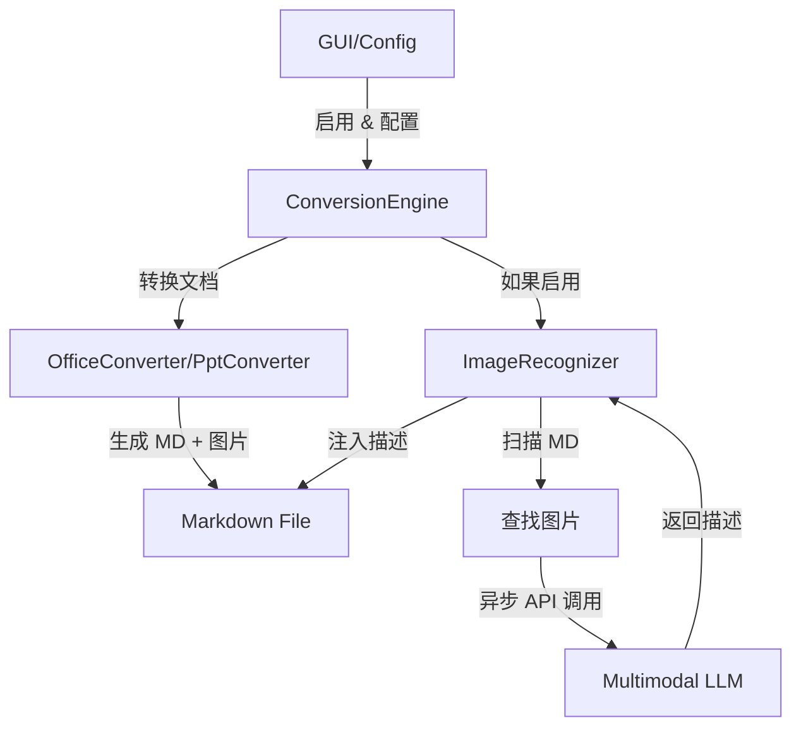

# DESIGN: Image Recognition (解析增强)

## 1. 系统架构

图片识别功能将作为转换管道中的后处理步骤实现。



## 2. 模块设计

### 2.1 配置 (`src/core/config.py`)

扩展 `ConfigManager` 以支持：

```json
"image_recognition": {
    "enabled": false,
    "api_base": "https://api.openai.com/v1",
    "api_key": "",
    "model": "gpt-4-vision-preview",
    "max_concurrency": 2
}
```

### 2.2 图片识别器 (`src/core/image_recognition.py`)

负责 LLM 交互和 Markdown 操作的新类。

**类**: `ImageRecognizer`
- **依赖**: `ConfigManager`, `aiohttp` (用于异步请求), `asyncio`。
- **方法**:
    - `__init__(config_manager)`: 加载设置。
    - `async recognize_image(image_path: Path) -> str`: 发送图片到 LLM。
        - 编码图片为 Base64。
        - 构造 payload (OpenAI 兼容)。
        - 处理错误 (返回空字符串或错误消息)。
    - `process_markdown(md_path: Path)`: 主要入口点 (异步的同步包装器)。
        - 读取 MD 文件。
        - 正则匹配 `!\[(.*?)\]\((.*?)\)`。
        - 验证图片路径 (相对于 MD)。
        - 创建受 `Semaphore` 限制的异步任务。
        - 将匹配的模式替换为 `\n\n> **图片解析**: ...`
        - 写回 MD 文件。

### 2.3 转换引擎 (`src/core/engine.py`)

更新 `convert_file` 方法：
1. 执行标准转换。
2. 如果 `target_suffix == '.md'` 且 `config.image_recognition.enabled`:
    - 初始化 `ImageRecognizer`。
    - 调用 `image_recognizer.process_markdown(final_path)`。
    - 记录进度/错误。

### 2.4 GUI (`src/gui/main.py`)

增加 "解析增强" 页签。
- **控件**:
    - 复选框: 启用功能。
    - 输入框: API Base URL。
    - 输入框: API Key (密码字段)。
    - 输入框: Model Name。
    - 微调框: 最大并发数 (1-5, 默认 2)。
- **逻辑**:
    - 使用 `ConfigManager` 加载/保存值。

## 3. 数据流

1.  **用户** 在 GUI 中启用功能并设置 API key。
2.  **引擎** 转换 `doc.docx` -> `doc.md` + `media/image1.png`。
3.  **引擎** 调用 `ImageRecognizer.process_markdown('doc.md')`。
4.  **识别器** 找到 ``。
5.  **识别器** 发送 `media/image1.png` 到 LLM。
6.  **LLM** 返回 "一张显示销售增长的图表。"
7.  **识别器** 更新 `doc.md`:
    ```markdown
    
    > **图片解析**: 一张显示销售增长的图表。
    ```

## 4. 技术栈

-   **语言**: Python 3。
-   **并发**: `asyncio` + `aiohttp` 用于非阻塞网络 I/O。
-   **GUI**: `tkinter`。
-   **正则**: 用于 Markdown 解析 (对于标准 Pandoc 输出足够简单且健壮)。

## 5. 安全与错误处理

-   **API Key**: 存储在 `config.json` (目前为明文，按照现有设计)。
-   **网络错误**: 记录警告，跳过特定图片，继续处理文档。
-   **文件访问**: 确保图片路径在允许的目录内。
