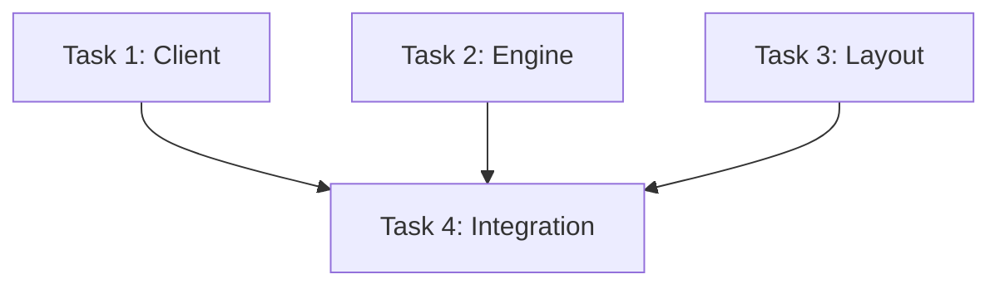

# TASK: RAGFlow集成增强

## 1. 任务拆解

### Task 1: RAGFlow 客户端核心 (src/core/ragflow_client.py)
- **目标**: 实现与 RAGFlow API 的交互。
- **子任务**:
    - [ ] 定义 `RAGFlowClient` 类。
    - [ ] 实现 `list_datasets` (GET /api/v1/dataset)。
    - [ ] 实现 `create_dataset` (POST /api/v1/dataset)。
    - [ ] 实现 `upload_document` (POST /api/v1/document/upload)。
    - [ ] 实现 `run_parsing` (POST /api/v1/document/run)。
    - [ ] 编写单元测试 `test/unit/test_ragflow_client.py` (Mock API)。

### Task 2: 转换引擎增强 (src/core/engine.py)
- **目标**: 支持文件转换完成的回调。
- **子任务**:
    - [ ] 修改 `ConversionEngine.run` 和 `convert_file`，支持 `on_file_converted` 回调参数。
    - [ ] 确保回调在主线程或 GUI 安全的方式被调用（GUI 层处理）。

### Task 3: GUI 布局重构 (src/gui/main.py)
- **目标**: 引入 Tabs 布局。
- **子任务**:
    - [ ] 引入 `ttk.Notebook`。
    - [ ] 将原有控件移动到 "转换" Tab。
    - [ ] 创建 "分发" Tab 的骨架。

### Task 4: GUI RAGFlow 集成 (src/gui/main.py)
- **目标**: 实现分发中心逻辑。
- **子任务**:
    - [ ] 实现 RAGFlow 配置区 (URL, Key) 及保存/加载。
    - [ ] 实现 `File List` (Treeview) 和 `ConversionEngine` 的联动。
    - [ ] 实现 `KB Selection` 下拉框的加载与刷新。
    - [ ] 实现 `New KB` 弹窗与逻辑。
    - [ ] 实现 `Upload` 按钮逻辑 (异步调用 Client)。

## 2. 依赖图

