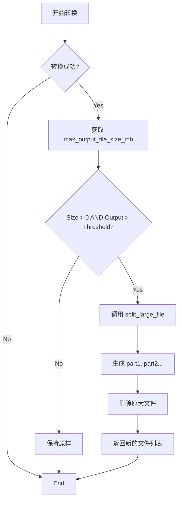

# DESIGN: 大文件自动切分策略

## 1. 系统架构变更
在 `ConversionEngine` 的文件转换流程末端增加“后处理”环节。

## 2. 接口设计

### 2.1 `src/core/config.py`
- 新增属性 `max_output_file_size_mb`: int
    - 在 `get_default_config` 中添加 `conversion_settings.max_output_file_size_mb = 50`。
    - 兼容旧配置文件：如果读取不到，返回默认值 50。

### 2.2 `src/core/utils.py`
- 新增函数 `split_large_file(file_path: Path, max_size_mb: int) -> List[Path]`
    - **输入**:
        - `file_path`: 待处理的 Markdown 文件路径。
        - `max_size_mb`: 阈值（MB）。
    - **输出**:
        - 如果未切分，返回 `[file_path]`。
        - 如果切分，返回 `[path_part1, path_part2, ...]`。
    - **逻辑**:
        1. 计算 `threshold_bytes = max_size_mb * 1024 * 1024`。
        2. 若 `file_path.stat().st_size <= threshold_bytes`，直接返回。
        3. 计算 `target_bytes = threshold_bytes * 0.9`。
        4. 打开源文件（utf-8），逐行读取。
        5. 维护 `current_chunk_size`。当 `current_chunk_size + len(line_bytes) > target_bytes` 时：
            - 关闭当前写入流。
            - 索引 `part_index += 1`。
            - 打开新文件 `original_stem_partX.md`。
            - 重置 `current_chunk_size`。
        6. 写入行，更新 `current_chunk_size`。
        7. 循环结束后，关闭所有流。
        8. 删除源文件。
        9. 返回生成的文件列表。

### 2.3 `src/core/engine.py`
- 修改 `convert_file` 方法：
    - 在 `final_path` 获取后，检查配置。
    - 调用 `utils.split_large_file(final_path, limit)`。
    - 更新日志或回调信息（可选，当前回调只接受状态字符串，可能不需要变更）。

## 3. 异常处理
- **IOError**: 读取或写入失败时，保留源文件，抛出异常或记录错误日志，不删除源文件。
- **EncodingError**: 如果文件不是 UTF-8，尝试使用系统默认编码或忽略错误，但 Everything2MD 统一产出 UTF-8，所以风险较低。

## 4. 验证计划
- 单元测试 `tests/test_splitter.py`:
    - 构造一个包含 1000 行文本的文件。
    - 设置极小的阈值（如 1KB）。
    - 验证生成了多个文件。
    - 验证所有分卷内容拼接后等于原文件。
- 集成测试:
    - 运行完整转换流程，设置低阈值，验证输出目录结构。
