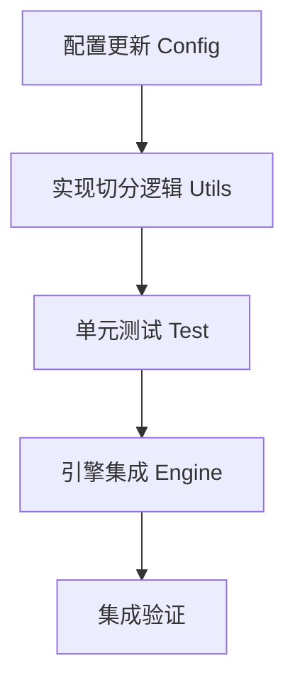

# TASK: 大文件自动切分策略

## 任务概览
实现输出文件的自动切分功能，确保生成的 Markdown 文件体积在配置的阈值范围内。

## 原子任务清单

### 任务 1: 更新配置管理
- **目标**: 在 `ConfigManager` 中支持 `max_output_file_size_mb`。
- **输入**: `src/core/config.py`
- **输出**: 修改后的 `src/core/config.py`
- **验收标准**:
    - `get_default_config()` 返回包含 `max_output_file_size_mb: 50` 的字典。
    - `get("max_output_file_size_mb")` 能正确返回配置值（int）。

### 任务 2: 实现文件切分工具函数
- **目标**: 编写按行切分文件的核心逻辑。
- **输入**: `src/core/utils.py`
- **输出**: 修改后的 `src/core/utils.py`
- **验收标准**:
    - 函数 `split_large_file(file_path, max_size_mb)` 存在。
    - 当文件小于阈值时，不进行任何操作，返回原路径。
    - 当文件大于阈值时，生成多个 `_partX.md` 文件。
    - 原始文件被删除。

### 任务 3: 编写切分逻辑单元测试
- **目标**: 验证切分逻辑的正确性和边界情况。
- **输入**: 新建 `tests/test_splitter.py`
- **输出**: 通过的测试报告。
- **验收标准**:
    - 覆盖正常切分场景。
    - 覆盖不需切分场景。
    - 验证内容完整性（拼接后一致）。

### 任务 4: 集成到转换引擎
- **目标**: 在转换流程结束后调用切分逻辑。
- **输入**: `src/core/engine.py`
- **输出**: 修改后的 `src/core/engine.py`
- **验收标准**:
    - `convert_file` 方法在成功转换后调用 `split_large_file`。
    - 能够处理 `split_large_file` 返回的新路径列表（虽然目前 `convert_file` 只返回单个 path，可能需要调整返回值或仅记录日志）。
    - *注意*: `convert_file` 签名返回 `final_path` (Path or False)。如果分裂了，返回第一个分卷的路径或主分卷路径，或者保持原逻辑返回原始路径（但文件已不存在？这会导致后续逻辑报错）。
    - *修正*: `convert_file` 应返回主要结果文件。如果分裂了，可以返回 `part1`，或者调整返回类型。考虑到兼容性，返回 `part1` 路径，并在日志中说明。

### 任务 5: 手动验证
- **目标**: 运行一次实际转换，观察结果。
- **验收标准**: 产物符合预期。
