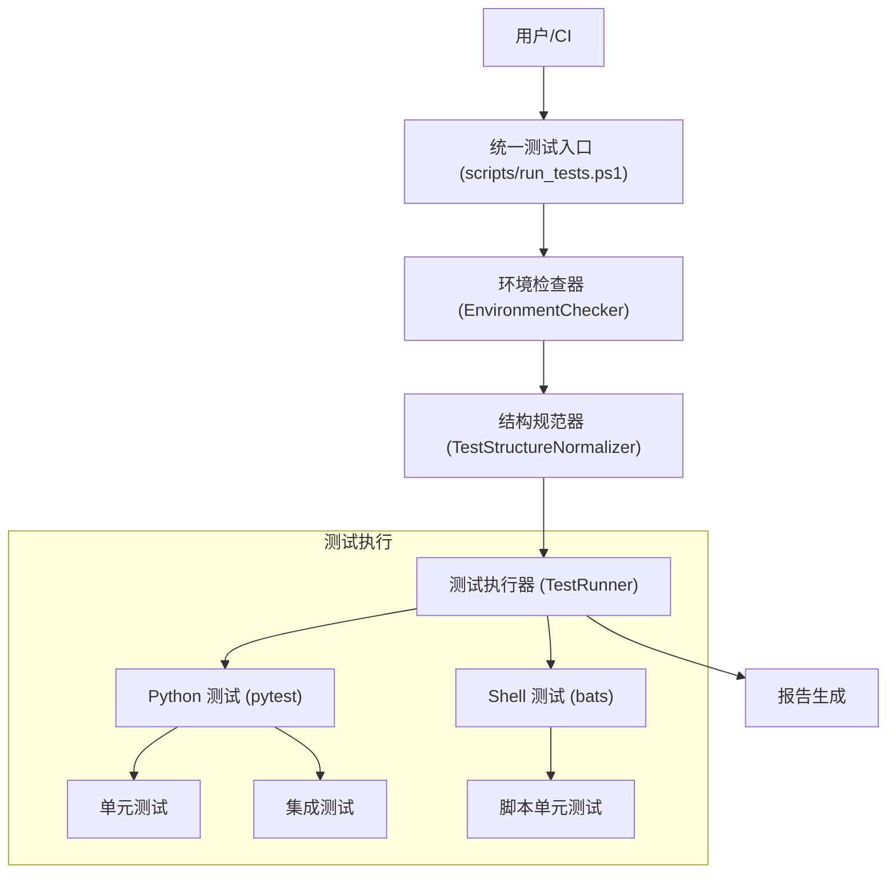

# DESIGN_SystemTestSubsystem

## 1. 整体架构

系统测试子系统作为一个独立的治理和执行模块，位于项目顶层，与业务代码解耦。

## 2. 模块设计

### 2.1 环境检查器 (EnvironmentChecker)
- **职责**: 确保测试运行环境符合规范。
- **逻辑**:
    1.  检查 `.venv` 是否存在且激活。
    2.  检查 `requirements.txt` 依赖是否已安装。
    3.  检查 `bash` (用于 bats) 是否可用。

### 2.2 结构规范器 (TestStructureNormalizer)
- **职责**: 维护测试目录的整洁和一致性。
- **逻辑**:
    1.  检测是否存在 `tests/` 目录。
    2.  如果存在，将其内容移动到 `test/integration/` (默认策略)。
    3.  删除空的 `tests/` 目录。
    4.  此步骤通常作为手动迁移任务或初始化脚本的一部分，但在测试运行前做检查也是合理的。

### 2.3 测试执行器 (TestRunner)
- **职责**: 调度具体的测试框架。
- **逻辑**:
    1.  接收参数 (all, unit, integration)。
    2.  调用 `pytest` 运行 Python 测试。
    3.  调用 `bats` 运行 Shell 测试。
    4.  收集退出代码，任何失败都视为整体失败。

## 3. 接口规范

### 3.1 命令行接口 (CLI)
`scripts/run_tests.ps1` 将作为主要对外接口。

- **参数**:
    - `Target`: `all` (默认), `test-python`, `test-bats`, `clean`.
- **输出**:
    - 标准输出显示测试进度和结果。
    - 退出代码：0 表示成功，非 0 表示失败。

## 4. 数据流
- 测试脚本 -> 产生日志/控制台输出 -> 用户
- 测试脚本 -> 产生覆盖率报告 (.coverage) -> 报告查看器

## 5. 异常处理
- **环境缺失**: 提示用户运行安装脚本，并退出。
- **测试失败**: 打印详细错误堆栈，并以非零状态码退出。
