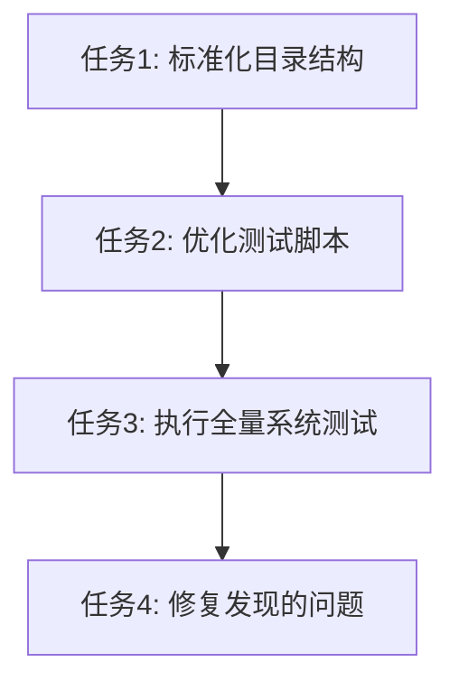

# TASK_SystemTestSubsystem

## 任务列表

### 任务 1: 标准化目录结构
- **目标**: 将 `tests/` 目录内容合并到 `test/integration/`，并删除 `tests/`。
- **输入**: `tests/verify_config_persistence.py`。
- **输出**: `test/integration/verify_config_persistence.py`，无 `tests/` 目录。
- **验收标准**: `tests/` 目录不存在，且文件已迁移。

### 任务 2: 优化测试脚本
- **目标**: 修改 `scripts/run_tests.ps1` 以符合设计规范。
- **输入**: 现有 `scripts/run_tests.ps1`。
- **输出**: 修改后的 `scripts/run_tests.ps1`。
- **验收标准**:
    - 使用 `.venv` 而非 `venv`。
    - 能正确检测 Python 解释器。
    - 包含对 Git Bash 的更健壮检查。

### 任务 3: 执行全量系统测试
- **目标**: 运行所有测试并记录结果。
- **输入**: 优化后的脚本。
- **输出**: 测试执行日志。
- **验收标准**: 脚本成功运行，输出测试结果。

### 任务 4: 修复发现的问题
- **目标**: 如果任务 3 中有测试失败，分析并修复（限于配置或环境问题）。
- **输入**: 测试失败日志。
- **输出**: 修复后的代码或配置。
- **验收标准**: 所有测试通过（或已知业务 Bug 已记录）。
