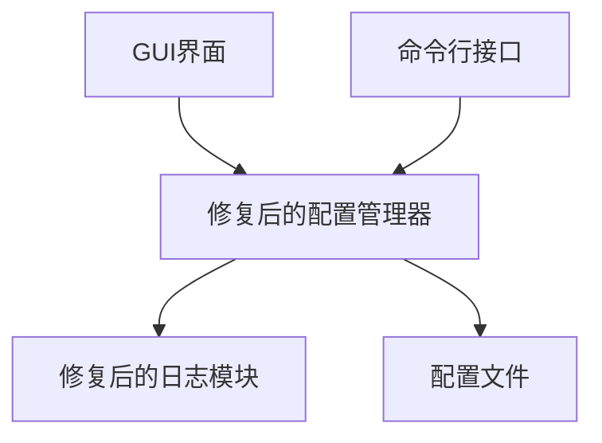
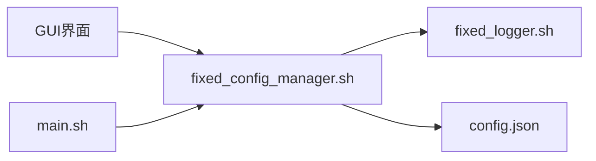
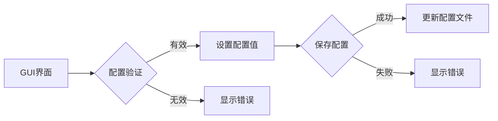

# 配置管理器编码问题修复设计文档

## 整体架构图



## 分层设计和核心组件

### 1. 日志模块层（fixed_logger.sh）
- 职责：提供日志记录功能
- 修改：将中文注释替换为英文注释，避免编码问题
- 接口：保持与原logger.sh完全一致

### 2. 配置管理层（fixed_config_manager.sh）
- 职责：加载、验证、保存配置
- 修改：改进编码处理逻辑，确保与GUI界面正确交互
- 接口：保持与原config_manager.sh完全一致

### 3. GUI界面层（fixed_main_v2.py）
- 职责：提供图形界面用于配置管理
- 修改：使用修复后的配置管理器
- 接口：保持与原GUI界面完全一致

## 模块依赖关系图



## 接口契约定义

### fixed_logger.sh接口
```
# 日志级别函数
log_debug()    # 记录调试信息
log_info()     # 记录普通信息
log_warn()     # 记录警告信息
log_error()    # 记录错误信息
```

### fixed_config_manager.sh接口
```
# 配置管理函数
load_config()              # 加载配置
save_config()              # 保存配置
get_config(key)            # 获取配置值
set_config(key, value)     # 设置配置值
validate_config(key, value) # 验证配置值
validate_current_config()  # 验证当前配置
backup_config()            # 备份配置
restore_config(file)       # 恢复配置
```

## 数据流向图



## 异常处理策略

### 编码异常处理
1. 所有脚本文件使用UTF-8编码
2. 配置文件读写时明确指定编码格式
3. 错误信息使用英文，避免编码问题

### 配置验证异常处理
1. 验证失败时返回明确的错误信息
2. 保留原有配置值，不进行部分更新
3. 提供详细的验证失败原因

### 文件操作异常处理
1. 配置文件操作前先备份
2. 操作失败时恢复备份文件
3. 记录详细的操作日志

## 设计原则

### 兼容性原则
- 保持与现有配置文件格式完全兼容
- 保持命令行接口不变
- 确保GUI界面功能不受影响

### 稳定性原则
- 最小化修改范围，降低引入新问题的风险
- 保持核心逻辑不变，只修复编码相关问题
- 充分测试确保修复效果

### 可维护性原则
- 代码结构清晰，易于理解和维护
- 添加必要的注释说明修改原因
- 保持与原文件的对比性，便于后续合并