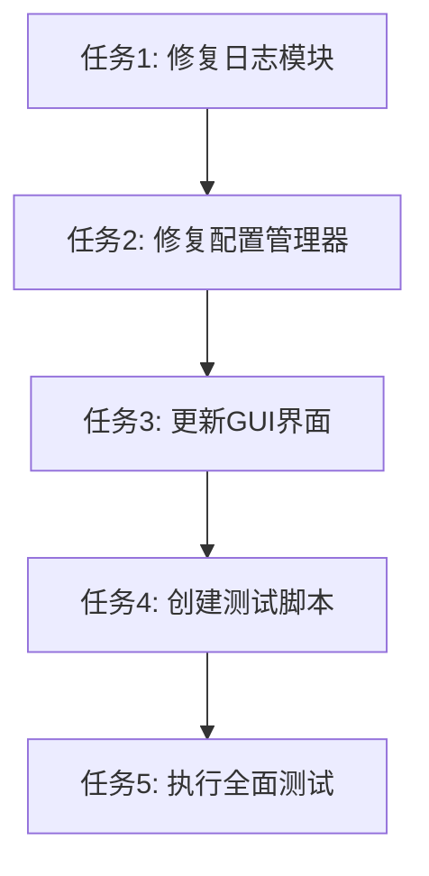

# 配置管理器编码问题修复任务分解

## 原子任务列表

### 任务1: 修复日志模块编码问题
- 输入契约：
  - 前置依赖：无
  - 输入数据：logger.sh源文件
  - 环境依赖：文本编辑器
- 输出契约：
  - 输出数据：fixed_logger.sh文件
  - 交付物：可替换原logger.sh的修复版本
  - 验收标准：文件中无中文注释，功能与原文件一致
- 实现约束：
  - 技术栈：bash脚本
  - 接口规范：保持与原logger.sh完全一致
  - 质量要求：无编码问题，功能正确
- 依赖关系：
  - 后置任务：任务2
  - 并行任务：无

### 任务2: 修复配置管理器编码问题
- 输入契约：
  - 前置依赖：任务1完成
  - 输入数据：config_manager.sh源文件，fixed_logger.sh文件
  - 环境依赖：bash环境，jq工具
- 输出契约：
  - 输出数据：fixed_config_manager.sh文件
  - 交付物：可替换原config_manager.sh的修复版本
  - 验收标准：能正确处理配置值，无编码错误
- 实现约束：
  - 技术栈：bash脚本
  - 接口规范：保持与原config_manager.sh完全一致
  - 质量要求：编码处理正确，功能完整
- 依赖关系：
  - 后置任务：任务3
  - 并行任务：无

### 任务3: 更新GUI界面使用修复后的组件
- 输入契约：
  - 前置依赖：任务2完成
  - 输入数据：main.py源文件，fixed_config_manager.sh文件
  - 环境依赖：Python环境，tkinter库
- 输出契约：
  - 输出数据：fixed_main_v2.py文件
  - 交付物：能正确保存配置的GUI界面
  - 验收标准：GUI界面能成功保存所有配置项，无编码错误
- 实现约束：
  - 技术栈：Python 3
  - 接口规范：保持与原GUI界面一致
  - 质量要求：界面响应正常，配置保存正确
- 依赖关系：
  - 后置任务：任务4
  - 并行任务：无

### 任务4: 创建测试验证脚本
- 输入契约：
  - 前置依赖：任务3完成
  - 输入数据：fixed_main_v2.py文件
  - 环境依赖：Python环境，测试框架
- 输出契约：
  - 输出数据：test_fixed_gui_v2.py文件
  - 交付物：完整的测试验证脚本
  - 验收标准：能全面验证修复效果
- 实现约束：
  - 技术栈：Python 3
  - 接口规范：标准测试脚本接口
  - 质量要求：覆盖所有关键功能点
- 依赖关系：
  - 后置任务：任务5
  - 并行任务：无

### 任务5: 执行全面测试验证
- 输入契约：
  - 前置依赖：任务4完成
  - 输入数据：所有修复后的文件
  - 环境依赖：完整的测试环境
- 输出契约：
  - 输出数据：测试报告
  - 交付物：通过所有测试的修复版本
  - 验收标准：所有测试用例通过，无编码错误
- 实现约束：
  - 技术栈：bash, Python 3
  - 接口规范：标准测试执行接口
  - 质量要求：100%测试通过率
- 依赖关系：
  - 后置任务：无
  - 并行任务：无

## 任务依赖图

## 复杂度评估

| 任务 | 复杂度 | 预估时间 | 风险等级 |
|------|--------|----------|----------|
| 任务1 | 低 | 30分钟 | 低 |
| 任务2 | 中 | 2小时 | 中 |
| 任务3 | 中 | 2小时 | 中 |
| 任务4 | 低 | 1小时 | 低 |
| 任务5 | 中 | 1小时 | 低 |

## 质量保证措施

1. 每个任务完成后进行单元测试
2. 保持与原文件的接口兼容性
3. 详细记录修改内容和原因
4. 执行全面的集成测试
5. 验证向后兼容性