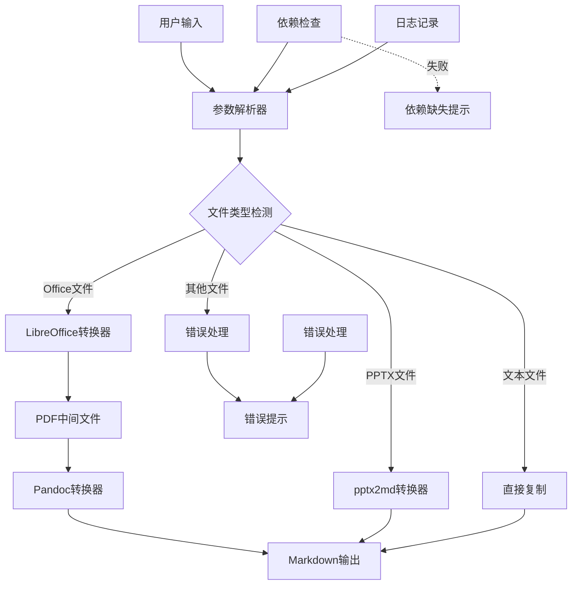
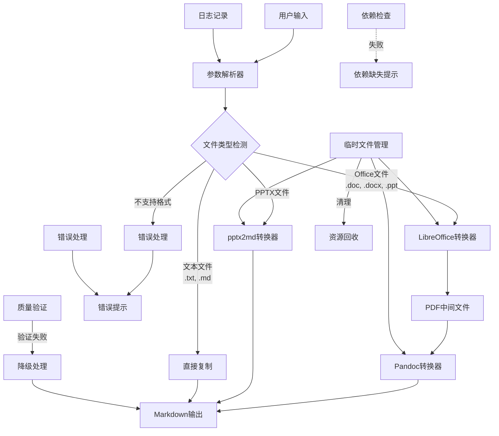
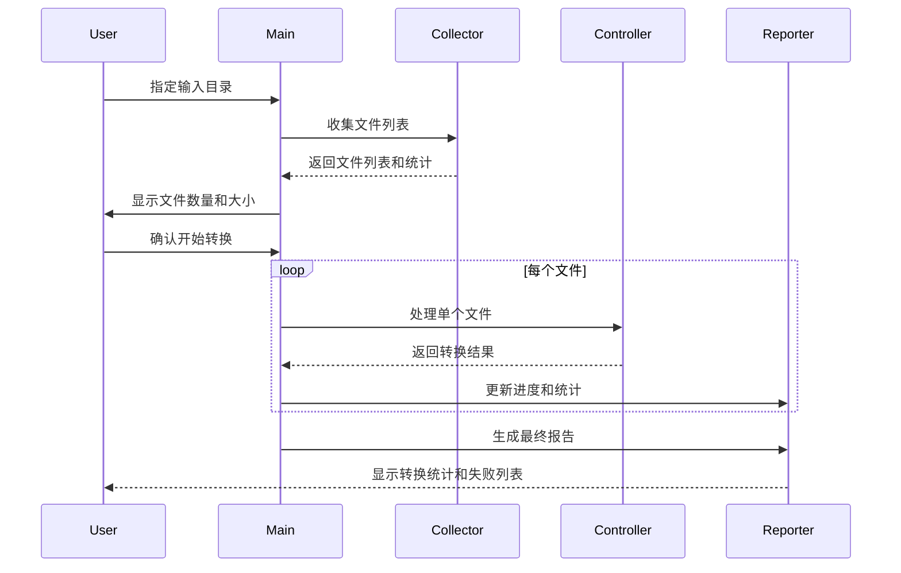

# Everything2MD 技术设计文档

## 1. 系统架构设计

### 1.1 整体架构



### 1.2 核心组件关系




#### 1.2.1 组件接口说明

**参数解析器**
- 接收用户输入的命令行参数
- 解析文件路径、输出路径和其他选项
- 验证参数的有效性

**文件类型检测**
- 根据文件扩展名判断文件类型
- 支持的类型：.doc, .docx, .ppt, .pptx, .txt, .md
- 对不支持的格式触发错误处理流程

**LibreOffice转换器**
- 接收Office文档(.doc, .docx, .ppt)作为输入
- 调用LibreOffice将文档转换为PDF格式
- 输出PDF中间文件供下一步处理

**pptx2md转换器**
- 专门处理.pptx文件
- 调用pptx2md库进行转换
- 直接输出Markdown格式

**Pandoc转换器**
- 接收PDF文件作为输入
- 调用Pandoc将PDF转换为Markdown
- 输出最终的Markdown文件

**直接复制**
- 处理.txt和.md文件
- 直接复制文件到输出位置
- 保持原有格式不变

#### 1.2.2 数据流向说明

1. **Office文档处理流程**：
   用户输入(.doc/.docx/.ppt) → LibreOffice转换器(PDF) → Pandoc转换器(Markdown) → 输出

2. **PPTX文档处理流程**：
   用户输入(.pptx) → pptx2md转换器(Markdown) → 输出

3. **文本文件处理流程**：
   用户输入(.txt/.md) → 直接复制 → 输出

4. **错误处理流程**：
   不支持的格式 → 错误处理 → 错误提示

5. **依赖检查流程**：
   程序启动 → 依赖检查 → 依赖缺失提示(如有缺失)

6. **临时文件管理流程**：
   各转换器 → 临时文件管理 → 资源回收(转换完成后清理)

7. **质量验证流程**：
   转换输出 → 质量验证 → 降级处理(如验证失败) → 输出


## 2. 关键模块设计

### 2.1 转换控制器设计

#### 2.1.1 核心功能
- 协调各组件工作流程
- 处理转换路径选择
- 管理临时文件生命周期
- 实现错误处理和降级策略

#### 2.1.2 转换流程

**Office文档转换流程：**
```
输入验证 → 依赖检查 → 格式检测 → 路径选择 → 
组件调用 → 结果验证 → 错误处理 → 清理资源
```

**PPTX文档转换流程：**
```
输入验证 → 依赖检查 → 格式验证 → 
pptx2md调用 → 结果验证 → 错误处理
```

#### 2.1.3 错误处理策略

**分层错误处理：**
1. **输入层**：文件存在性、格式有效性验证
2. **依赖层**：组件可用性检查和安装指导
3. **转换层**：组件调用错误和异常处理
4. **输出层**：结果质量验证和降级处理

**降级策略：**
```python
import os
import logging

def process_with_fallback(input_file, output_file):
    # 尝试标准转换
    if process_standard_conversion(input_file, output_file):
        if validate_output_quality(output_file):
            return True
    
    # 降级处理：提取纯文本
    logging.warning("标准转换失败，尝试降级处理")
    if extract_text_content(input_file, output_file):
        logging.info("降级处理成功，输出纯文本格式")
        return True
    
    return False
```

### 2.2 组件接口设计

#### 2.2.1 LibreOffice接口

**功能：** 将Office文档转换为PDF格式

**接口定义：**
```python
import os
import subprocess
import logging
import tempfile

def convert_office_to_pdf(input_file, output_dir):
    # 输入验证
    if not validate_input_file(input_file):
        return False
    
    # 依赖检查
    if not check_libreoffice():
        return False
    
    # 执行转换（带超时和重试）
    result = False
    
    for attempt in range(1, 4):
        try:
            # 使用subprocess执行命令，设置超时时间
            subprocess.run([
                'libreoffice', '--headless', '--convert-to', 'pdf',
                '--outdir', output_dir, input_file
            ], check=True, timeout=60, capture_output=True, text=True)
            
            result = True
            break
        except subprocess.TimeoutExpired:
            logging.warning(f"LibreOffice 转换尝试 {attempt} 超时，正在重试...")
            # 等待2秒后重试
            time.sleep(2)
        except subprocess.CalledProcessError as e:
            logging.warning(f"LibreOffice 转换尝试 {attempt} 失败，正在重试... 错误: {e}")
            time.sleep(2)
    
    # 结果验证
    if result:
        return validate_pdf_output(output_dir, input_file)
    else:
        logging.error("LibreOffice 转换失败")
        return False
```

**错误处理：**
- 输入文件格式验证
- LibreOffice可用性检查
- 转换超时处理（60秒）
- 重试机制（最多3次）
- 结果文件验证

#### 2.2.2 Pandoc接口修复

**问题分析：**
当前实现错误地使用 `-f html` 参数处理PDF文件：
```python
# 错误实现
# pandoc "$input_file" -f html -t markdown -o "$output_file" --wrap=none
```

**修复方案：**
```python
import subprocess
import logging

def convert_pdf_to_markdown(input_file, output_file):
    # 输入验证
    if not validate_pdf_file(input_file):
        return False
    
    # 依赖检查
    if not check_pandoc():
        return False
    
    # 尝试使用Pandoc的PDF支持
    result = False
    
    # 方案1：尝试PDF解析
    try:
        # 使用subprocess执行命令
        subprocess.run([
            'pandoc', input_file, '-f', 'pdf', '-t', 'markdown',
            '-o', output_file, '--wrap=none'
        ], check=True, capture_output=True, text=True)
        
        # 验证输出质量
        if validate_output_quality(output_file):
            result = True
        else:
            logging.warning("Pandoc PDF转换输出质量不佳")
    except subprocess.CalledProcessError as e:
        logging.warning(f"Pandoc PDF转换失败，尝试降级方案 错误: {e}")
    
    # 方案2：降级处理（如果方案1失败）
    if not result:
        if extract_text_from_pdf(input_file, output_file):
            logging.info("使用文本提取降级方案成功")
            result = True
    
    return result
```

#### 2.2.3 pptx2md接口优化

**功能增强：**
- 输入文件格式验证
- 错误处理和重试机制
- 输出质量检查
- 与其他组件接口一致性

**实现优化：**
```python
import subprocess
import logging

def convert_pptx_to_markdown(input_file, output_file):
    # 输入验证
    if not validate_pptx_file(input_file):
        return False
    
    # 依赖检查
    if not check_pptx2md():
        return False
    
    # 执行转换
    result = False
    
    try:
        # 使用subprocess执行命令
        subprocess.run([
            'pptx2md', input_file, '--output', output_file
        ], check=True, capture_output=True, text=True)
        
        # 验证输出
        if validate_output_quality(output_file):
            result = True
        else:
            logging.warning("pptx2md转换输出质量不佳")
    except subprocess.CalledProcessError as e:
        logging.error(f"pptx2md转换失败: {e.stderr}")
    
    return result
```

### 2.3 依赖检查系统设计

#### 2.3.1 检查策略
- **预检机制**：程序启动前进行依赖检查
- **详细报告**：提供缺失组件列表和安装指导
- **平台适配**：支持不同操作系统的检测方式

#### 2.3.2 实现方案
```python
import subprocess
import logging

def check_all_dependencies():
    missing_deps = []
    warnings = []
    
    # 检查 LibreOffice
    try:
        result = subprocess.run(['libreoffice', '--version'], 
                              capture_output=True, text=True, check=True)
        logging.info(f"LibreOffice版本: {result.stdout.splitlines()[0]}")
    except (subprocess.CalledProcessError, FileNotFoundError):
        missing_deps.append("libreoffice")
    
    # 检查 Pandoc
    try:
        result = subprocess.run(['pandoc', '--version'], 
                              capture_output=True, text=True, check=True)
        logging.info(f"Pandoc版本: {result.stdout.splitlines()[0]}")
    except (subprocess.CalledProcessError, FileNotFoundError):
        missing_deps.append("pandoc")
    
    # 检查 pptx2md
    try:
        result = subprocess.run(['pptx2md', '--version'], 
                              capture_output=True, text=True, check=True)
        logging.info(f"pptx2md版本: {result.stdout.splitlines()[0]}")
    except (subprocess.CalledProcessError, FileNotFoundError):
        missing_deps.append("pptx2md")
    
    # 返回结果
    if missing_deps:
        show_install_instructions(missing_deps)
        return False
    
    logging.info("所有依赖检查通过")
    return True

def show_install_instructions(missing_deps):
    print("检测到以下依赖缺失，请安装后重试：")
    print()
    
    for dep in missing_deps:
        if dep == "libreoffice":
            print("📄 LibreOffice:")
            print("  Ubuntu/Debian: sudo apt-get install libreoffice")
            print("  macOS: brew install --cask libreoffice")
            print("  CentOS: sudo yum install libreoffice")
        elif dep == "pandoc":
            print("📝 Pandoc:")
            print("  Ubuntu/Debian: sudo apt-get install pandoc")
            print("  macOS: brew install pandoc")
            print("  CentOS: sudo yum install pandoc")
        elif dep == "pptx2md":
            print("📊 pptx2md:")
            print("  pip install pptx2md")
            print("  需要 Python 3.6+")
        print()
```

## 3. 批量转换架构

### 3.1 处理流程



### 3.2 文件收集策略

```python
import os
import subprocess

def collect_files(input_dir, recursive=False):
    supported_extensions = ["doc", "docx", "pptx"]
    
    # 构建find命令
    find_cmd = ["find", input_dir, "-type", "f"]
    
    # 构建扩展名过滤条件
    if len(supported_extensions) > 1:
        find_cmd.extend(["("])
        for i, ext in enumerate(supported_extensions):
            if i > 0:
                find_cmd.extend(["-o"])
            find_cmd.extend(["-name", f"*.{ext}"])
        find_cmd.extend([")"])
    else:
        find_cmd.extend(["-name", f"*.{supported_extensions[0]}"])
    
    # 递归选项
    if not recursive:
        find_cmd.extend(["-maxdepth", "1"])
    
    # 执行查找
    try:
        result = subprocess.run(find_cmd, capture_output=True, text=True, check=True)
        files = result.stdout.strip().split('\n')
        # 过滤空行并排序
        return sorted([f for f in files if f])
    except subprocess.CalledProcessError:
        return []
```

### 3.3 进度和统计

```python
import os
import logging

def process_batch_files(file_list):
    total_count = len(file_list)
    success_count = 0
    failed_files = []
    
    logging.info(f"开始批量转换，共 {total_count} 个文件")
    
    for i, input_file in enumerate(file_list):
        file_num = i + 1
        
        # 显示进度
        progress = (file_num / total_count) * 100
        print(f"\r进度: {file_num}/{total_count} ({progress:.1f}%)", end='', flush=True)
        
        # 处理文件
        output_file = calculate_output_path(input_file)
        
        if process_single_file(input_file, output_file):
            success_count += 1
        else:
            failed_files.append(input_file)
            logging.error(f"转换失败: {input_file}")
    
    print()  # 换行
    
    # 生成报告
    generate_batch_report(total_count, success_count, failed_files)

def generate_batch_report(total, success, failed_files):
    failed_count = len(failed_files)
    success_rate = (success / total) * 100 if total > 0 else 0
    
    print("==================================")
    print("批量转换完成报告")
    print("==================================")
    print(f"总文件数: {total}")
    print(f"成功: {success}")
    print(f"失败: {failed_count}")
    print(f"成功率: {success_rate:.1f}%")
    print("==================================")
    
    if failed_count > 0:
        print("失败文件列表:")
        for file in failed_files:
            print(f"  - {file}")
        print("==================================")
```

### 4.2 恢复机制

```python
import os
import logging
import sys

# 错误处理框架
def setup_error_handling():
    # 创建恢复点
    create_recovery_checkpoint()

def handle_error(exit_code, line_number):
    error_context = get_error_context()
    
    logging.error(f"程序错误: 退出码={exit_code}, 行号={line_number}")
    logging.error(f"错误上下文: {error_context}")
    
    # 尝试恢复
    if os.path.exists(RECOVERY_CHECKPOINT):
        if restore_from_checkpoint():
            logging.info("已从检查点恢复，继续执行")
            return True
    
    # 无法恢复，清理退出
    cleanup_on_error()
    sys.exit(exit_code)

# 具体的错误处理函数
def handle_file_error(file_path, error_type):
    if error_type == "not_found":
        logging.error(f"文件不存在: {file_path}")
        suggest_similar_files(file_path)
    elif error_type == "not_readable":
        logging.error(f"文件无法读取: {file_path}")
        check_file_permissions(file_path)
    elif error_type == "unsupported_format":
        logging.error(f"不支持的文件格式: {file_path}")
        show_supported_formats()
    else:
        logging.error(f"文件错误: {file_path} (类型: {error_type})")
```

## 5. 性能优化设计

### 5.1 内存管理
- **临时文件及时清理**：使用陷阱机制确保清理
- **大文件分块处理**：避免内存溢出
- **进程资源限制**：设置合理的资源上限

### 5.2 并发处理（可选）
```python
import os
import logging
from concurrent.futures import ThreadPoolExecutor, as_completed

# 并行处理实现
def process_files_parallel(file_list, max_workers=4):
    logging.info(f"使用并行处理，最大工作线程数: {max_workers}")
    
    # 使用线程池处理文件
    with ThreadPoolExecutor(max_workers=max_workers) as executor:
        # 提交任务
        future_to_file = {
            executor.submit(process_single_file_wrapper, file_path): file_path 
            for file_path in file_list
        }
        
        success_count = 0
        failed_files = []
        total_count = len(file_list)
        
        # 处理完成的任务
        for future in as_completed(future_to_file):
            file_path = future_to_file[future]
            try:
                result = future.result()
                if result:
                    success_count += 1
                    logging.info(f"SUCCESS: {file_path}")
                else:
                    failed_files.append(file_path)
                    logging.error(f"FAILED: {file_path}")
            except Exception as e:
                failed_files.append(file_path)
                logging.error(f"EXCEPTION: {file_path} - {e}")
            
            # 更新进度显示
            show_progress(success_count, total_count)
        
        return success_count, failed_files

def process_single_file_wrapper(file_path):
    """包装函数，用于处理单个文件"""
    output_file = f"{os.path.splitext(file_path)[0]}.md"
    return process_single_file(file_path, output_file)
```

## 6. 质量保证机制

### 6.1 输出质量验证
```python
import os

def validate_conversion_quality(input_file, output_file, min_quality_score=60):
    # 多维度质量检查
    checks = [
        f"check_file_exists:{output_file}",
        f"check_min_size:{output_file}:100",  # 最小100字节
        f"check_content_validity:{output_file}",
        f"check_structure_integrity:{output_file}",
    ]
    
    quality_score = 0
    total_checks = len(checks)
    
    for check in checks:
        check_parts = check.split(':')
        check_type = check_parts[0]
        check_args = ':'.join(check_parts[1:])
        
        if perform_quality_check(check_type, check_args):
            quality_score += 100 // total_checks
    
    if quality_score >= min_quality_score:
        logging.info(f"质量检查通过: {quality_score}%")
        return True
    else:
        logging.warning(f"质量检查未通过: {quality_score}% (要求: {min_quality_score}%)")
        return False
```

### 6.2 测试策略
- **单元测试**：每个模块独立测试
- **集成测试**：模块间协作测试
- **端到端测试**：完整流程测试
- **性能测试**：大文件和批量处理测试
- **兼容性测试**：不同平台和组件版本测试

这个技术设计文档提供了完整的系统架构、详细的实现方案和全面的质量保证机制，为项目的稳定实现提供了坚实的技术基础。