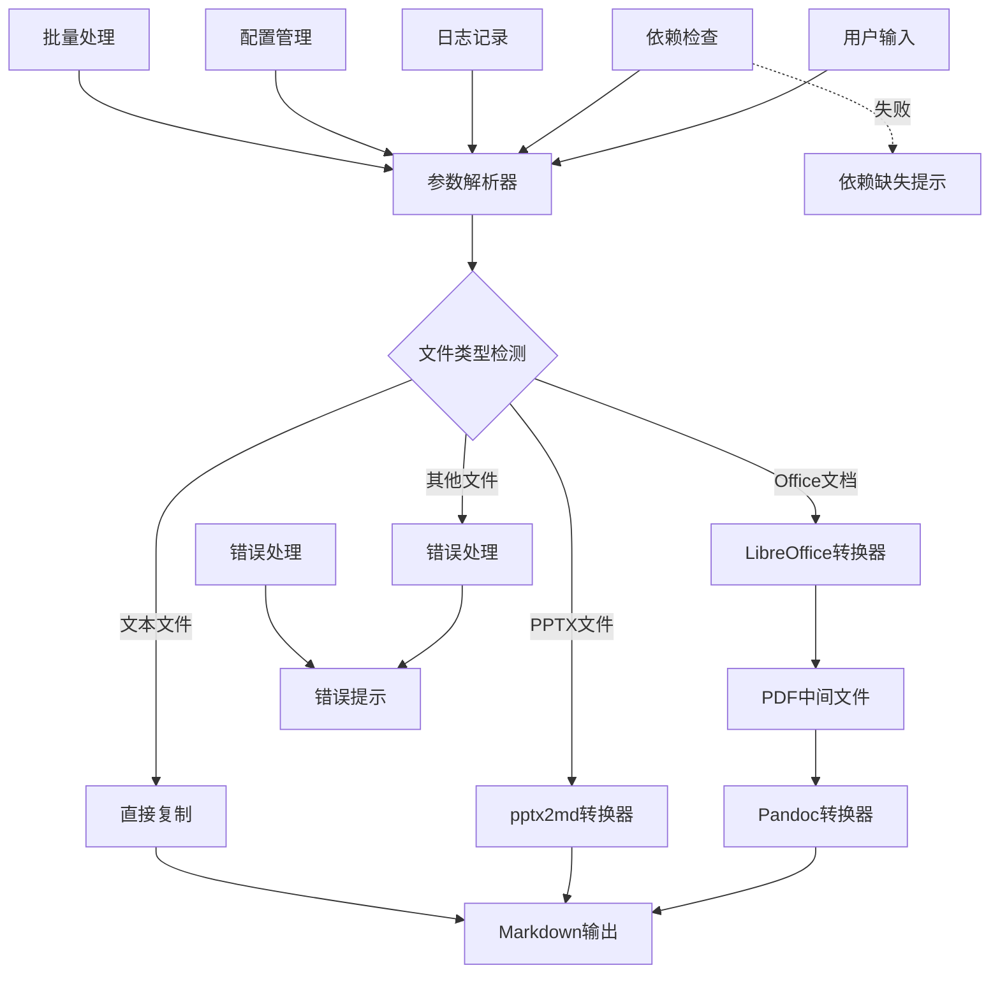
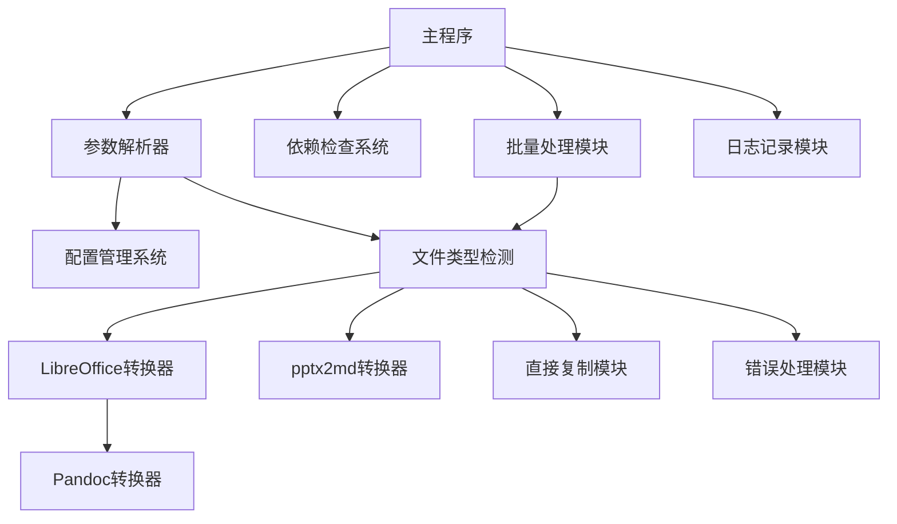

# Everything2MD 系统架构设计文档

## 1. 整体架构设计

### 1.1 架构概述

Everything2MD 采用模块化分层架构设计，遵循高内聚、低耦合的设计原则。系统架构分为以下几个层次：

1. **用户接口层**：提供命令行界面，处理用户输入和输出
2. **配置管理层**：处理配置参数解析和验证
3. **核心控制层**：协调各组件工作流程，处理转换路径选择
4. **转换处理层**：包含各种文档格式转换的具体实现
5. **辅助服务层**：提供依赖检查、错误处理、日志记录等辅助功能

### 1.2 系统架构图



### 1.3 数据流向设计

1. **Office文档处理流程**：
   用户输入(.doc/.docx/.ppt) → LibreOffice转换器(PDF) → Pandoc转换器(Markdown) → 输出

2. **PPTX文档处理流程**：
   用户输入(.pptx) → pptx2md转换器(Markdown) → 输出

3. **文本文件处理流程**：
   用户输入(.txt/.md) → 直接复制 → 输出

4. **错误处理流程**：
   不支持的格式 → 错误处理 → 错误提示

5. **依赖检查流程**：
   程序启动 → 依赖检查 → 依赖缺失提示(如有缺失)

## 2. 核心组件设计

### 2.1 参数解析器

**功能**：处理命令行参数和配置文件

**接口定义**：
- 输入：命令行参数、配置文件路径
- 输出：解析后的参数对象
- 功能：
  - 解析命令行参数
  - 加载配置文件
  - 验证参数有效性
  - 处理参数优先级（命令行 > 配置文件 > 环境变量 > 默认值）

### 2.2 文件类型检测

**功能**：根据文件扩展名确定处理路径

**接口定义**：
- 输入：文件路径
- 输出：文件类型标识
- 功能：
  - 检测文件扩展名
  - 映射到对应的处理组件
  - 处理不支持的格式

### 2.3 LibreOffice转换器

**功能**：处理 .doc, .docx, .ppt 文件

**接口定义**：
- 输入：Office文档路径、输出目录
- 输出：PDF文件路径
- 功能：
  - 调用LibreOffice将文档转换为PDF
  - 处理转换异常
  - 验证输出文件

### 2.4 pptx2md转换器

**功能**：处理 .pptx 文件

**接口定义**：
- 输入：PPTX文件路径、输出路径
- 输出：Markdown文件路径
- 功能：
  - 调用pptx2md库进行转换
  - 处理转换异常
  - 验证输出文件

### 2.5 Pandoc转换器

**功能**：将PDF转换为Markdown

**接口定义**：
- 输入：PDF文件路径、输出路径
- 输出：Markdown文件路径
- 功能：
  - 调用Pandoc将PDF转换为Markdown
  - 处理转换异常
  - 验证输出文件

### 2.6 直接复制模块

**功能**：处理 .txt 和 .md 文件

**接口定义**：
- 输入：源文件路径、目标路径
- 输出：复制结果状态
- 功能：
  - 直接复制文件
  - 保持原有格式不变

### 2.7 依赖检查系统

**功能**：验证运行环境

**接口定义**：
- 输入：无
- 输出：依赖检查结果
- 功能：
  - 检查LibreOffice可用性
  - 检查Pandoc可用性
  - 检查pptx2md可用性
  - 提供安装指导

### 2.8 批量处理模块

**功能**：实现批量文件处理功能

**接口定义**：
- 输入：目录路径、处理选项
- 输出：处理结果统计
- 功能：
  - 递归扫描目录
  - 处理文件列表
  - 生成处理报告

### 2.9 配置管理系统

**功能**：处理用户配置选项

**接口定义**：
- 输入：配置文件路径、环境变量
- 输出：配置对象
- 功能：
  - 解析JSON配置文件
  - 验证配置有效性
  - 提供默认配置值

## 3. 模块依赖关系



## 4. 接口契约定义

### 4.1 核心接口规范

所有组件遵循统一的接口规范：

```bash
# 组件调用接口
component_name input_file output_file [options]

# 返回值规范
# 0: 成功
# 1: 参数错误
# 2: 依赖缺失
# 3: 转换失败
# 4: 权限错误
```

### 4.2 数据格式规范

1. **配置文件格式**：JSON格式
2. **日志格式**：标准日志格式，包含时间戳、级别、消息
3. **错误信息格式**：结构化错误信息，包含错误码、描述、建议

## 5. 异常处理策略

### 5.1 分层错误处理

1. **输入层**：文件存在性、格式有效性验证
2. **依赖层**：组件可用性检查和安装指导
3. **转换层**：组件调用错误和异常处理
4. **输出层**：结果质量验证和降级处理

### 5.2 错误分类与处理

#### 5.2.1 可恢复错误
- 文件权限不足：提示用户检查权限设置
- 磁盘空间不足：提示用户清理磁盘空间
- 组件版本不兼容：提示用户升级或降级组件

#### 5.2.2 不可恢复错误
- 文件损坏：记录日志并跳过该文件
- 系统资源耗尽：终止程序并输出错误信息

### 5.3 降级策略

当标准转换失败时，系统将采用降级处理：
1. 尝试提取纯文本内容
2. 提供详细的错误信息和解决建议
3. 保留原始文件不被损坏

### 5.4 日志记录机制

#### 5.4.1 日志级别
- **DEBUG**：详细调试信息
- **INFO**：一般信息
- **WARN**：警告信息
- **ERROR**：错误信息

#### 5.4.2 日志内容
- 时间戳
- 错误级别
- 错误描述
- 相关文件路径
- 建议解决方案

### 5.5 断点续传机制

#### 5.5.1 实现原理
- 记录已处理文件列表
- 支持从中断位置继续处理
- 避免重复处理已成功转换的文件

#### 5.5.2 状态管理
- 处理状态文件存储
- 状态信息持久化
- 状态恢复机制

## 6. 性能优化设计

### 6.1 并发处理

支持多线程并发处理文件，提高批量转换效率。

### 6.2 缓存机制

实现缓存机制避免重复处理相同文件。

### 6.3 内存管理

优化内存使用，支持大文件处理。