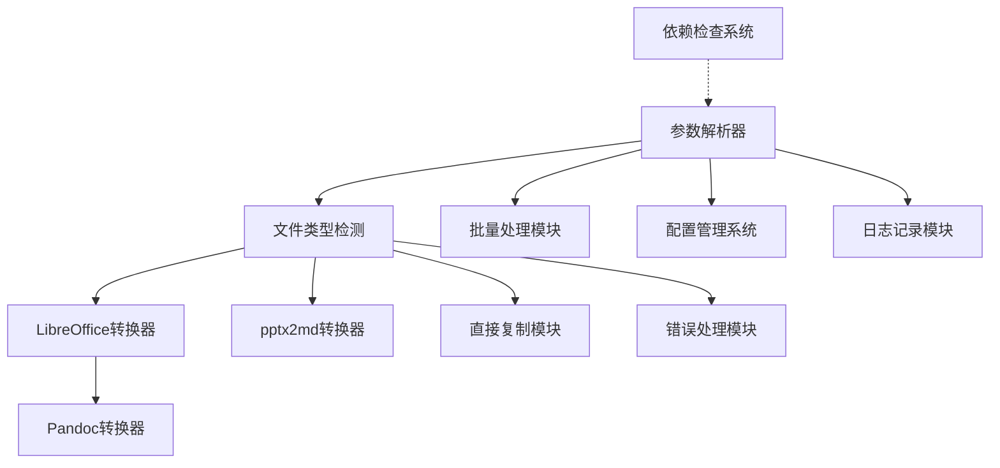

# Everything2MD 原子任务分解文档

## 1. 任务概述

本文档将Everything2MD系统的架构设计拆分为具体的原子任务，并定义每个任务的输入输出契约、实现约束和依赖关系。

## 2. 原子任务列表

### 任务1: 参数解析器实现

#### 输入契约
- 前置依赖: 无
- 输入数据: 命令行参数、配置文件路径
- 环境依赖: 无特殊要求

#### 输出契约
- 输出数据: 解析后的参数对象
- 交付物: 参数解析器模块代码
- 验收标准: 
  - 正确解析所有支持的命令行参数
  - 正确加载和解析配置文件
  - 正确处理参数优先级
  - 提供清晰的错误提示信息

#### 实现约束
- 技术栈: Bash脚本
- 接口规范: 符合架构设计文档中的接口定义
- 质量要求: 代码简洁、易于维护

#### 依赖关系
- 后置任务: 文件类型检测、依赖检查系统
- 并行任务: 无

### 任务2: 文件类型检测实现

#### 输入契约
- 前置依赖: 参数解析器
- 输入数据: 文件路径
- 环境依赖: 文件系统访问权限、file命令可用

#### 输出契约
- 输出数据: 文件类型标识（office/ppt/pptx/text/pdf/unknown）
- 交付物: src/modules/file_detector.sh
- 验收标准: 
  - 正确识别所有支持的文件类型
  - 对不支持的格式返回适当的错误信息
  - 处理文件扩展名大小写不敏感
  - 当扩展名无法确定时使用file命令检测MIME类型
  - 精确区分office、ppt、pptx类型

#### 实现约束
- 技术栈: Bash脚本
- 接口规范: detect_file_type 函数
- 质量要求: 代码简洁、易于维护

### 任务3: LibreOffice转换器实现

#### 输入契约
- 前置依赖: 文件类型检测
- 输入数据: Office文档路径、输出目录
- 环境依赖: LibreOffice >= 7.0、临时文件系统权限

#### 输出契约
- 输出数据: HTML文件路径
- 交付物: src/modules/libreoffice_converter.sh
- 验收标准: 
  - 成功调用LibreOffice将文档转换为HTML
  - 正确处理转换异常
  - 支持中文文件名安全处理
  - 正确处理临时文件

#### 实现约束
- 技术栈: Bash脚本 + LibreOffice CLI
- 接口规范: convert_office_to_md 函数
- 质量要求:
  - 代码简洁、易于维护
  - 错误处理完善
  - 支持批量处理
  - 中文文件名安全处理（创建安全临时路径）
  - 改进HTML文件查找逻辑（多种可能模式）

#### 依赖关系
- 后置任务: Pandoc转换器
- 并行任务: pptx2md转换器、直接复制模块

### 任务4: PPT转换器实现

#### 输入契约
- 前置依赖: 文件类型检测
- 输入数据: PPT文件路径、输出路径
- 环境依赖: LibreOffice命令行工具

#### 输出契约
- 输出数据: Markdown文件路径
- 交付物: src/modules/ppt_converter.sh
- 验收标准: 
  - 成功调用LibreOffice将PPT转换为PDF再转为Markdown
  - 正确处理转换异常
  - 验证输出文件的有效性

#### 实现约束
- 技术栈: Bash脚本 + LibreOffice CLI
- 接口规范: convert_ppt_to_md 函数
- 质量要求: 代码简洁、易于维护

#### 依赖关系
- 后置任务: Pandoc转换器
- 并行任务: LibreOffice转换器、pptx2md转换器、直接复制模块

### 任务5: Pandoc转换器实现

#### 输入契约
- 前置依赖: LibreOffice转换器
- 输入数据: PDF文件路径、输出路径
- 环境依赖: Pandoc工具

#### 输出契约
- 输出数据: Markdown文件路径
- 交付物: Pandoc转换器模块代码
- 验收标准: 
  - 成功调用Pandoc将PDF转换为Markdown
  - 正确处理转换异常
  - 验证输出文件的有效性

#### 实现约束
- 技术栈: Bash脚本
- 接口规范: 符合架构设计文档中的接口定义
- 质量要求: 代码简洁、易于维护

#### 依赖关系
- 后置任务: 无直接后置任务
- 并行任务: 无

### 任务6: 直接复制模块实现

#### 输入契约
- 前置依赖: 文件类型检测
- 输入数据: 源文件路径、目标路径
- 环境依赖: 无特殊要求

#### 输出契约
- 输出数据: 复制结果状态
- 交付物: 直接复制模块代码
- 验收标准: 
  - 成功复制文件
  - 保持原有格式不变
  - 正确处理复制过程中的异常

#### 实现约束
- 技术栈: Bash脚本
- 接口规范: 符合架构设计文档中的接口定义
- 质量要求: 代码简洁、易于维护

#### 依赖关系
- 后置任务: 无直接后置任务
- 并行任务: LibreOffice转换器、pptx2md转换器

### 任务7: 依赖检查系统实现

#### 输入契约
- 前置依赖: 无
- 输入数据: 无
- 环境依赖: 无特殊要求

#### 输出契约
- 输出数据: 依赖检查结果
- 交付物: 依赖检查系统模块代码
- 验收标准: 
  - 正确检查LibreOffice可用性
  - 正确检查Pandoc可用性
  - 正确检查pptx2md可用性
  - 提供清晰的安装指导信息

#### 实现约束
- 技术栈: Bash脚本
- 接口规范: 符合架构设计文档中的接口定义
- 质量要求: 代码简洁、易于维护

#### 依赖关系
- 后置任务: 无直接后置任务
- 并行任务: 参数解析器

### 任务8: 批量处理模块实现

#### 输入契约
- 前置依赖: 参数解析器
- 输入数据: 目录路径、处理选项
- 环境依赖: 无特殊要求

#### 输出契约
- 输出数据: 处理结果统计
- 交付物: 批量处理模块代码
- 验收标准: 
  - 正确递归扫描目录
  - 正确处理文件列表
  - 生成正确的处理报告

#### 实现约束
- 技术栈: Bash脚本
- 接口规范: 符合架构设计文档中的接口定义
- 质量要求: 代码简洁、易于维护

#### 依赖关系
- 后置任务: 无直接后置任务
- 并行任务: 依赖检查系统

### 任务9: 配置管理系统实现

#### 输入契约
- 前置依赖: 参数解析器
- 输入数据: 配置文件路径、环境变量
- 环境依赖: 无特殊要求

#### 输出契约
- 输出数据: 配置对象
- 交付物: 配置管理系统模块代码
- 验收标准: 
  - 正确解析JSON配置文件
  - 正确验证配置有效性
  - 提供正确的默认配置值

#### 实现约束
- 技术栈: Bash脚本
- 接口规范: 符合架构设计文档中的接口定义
- 质量要求: 代码简洁、易于维护

#### 依赖关系
- 后置任务: 无直接后置任务
- 并行任务: 依赖检查系统、批量处理模块

### 任务10: 错误处理模块实现

#### 输入契约
- 前置依赖: 文件类型检测
- 输入数据: 错误信息
- 环境依赖: 无特殊要求

#### 输出契约
- 输出数据: 结构化错误信息
- 交付物: 错误处理模块代码
- 验收标准: 
  - 正确分类和处理不同类型的错误
  - 提供清晰的错误提示信息
  - 实现降级处理策略

#### 实现约束
- 技术栈: Bash脚本
- 接口规范: 符合架构设计文档中的接口定义
- 质量要求: 代码简洁、易于维护

#### 依赖关系
- 后置任务: 无直接后置任务
- 并行任务: LibreOffice转换器、pptx2md转换器、直接复制模块

### 任务11: 日志记录模块实现

#### 输入契约
- 前置依赖: 参数解析器
- 输入数据: 日志信息、日志级别
- 环境依赖: 无特殊要求

#### 输出契约
- 输出数据: 日志记录
- 交付物: 日志记录模块代码
- 验收标准: 
  - 正确记录不同级别的日志信息
  - 提供结构化的日志格式
  - 支持日志文件输出

#### 实现约束
- 技术栈: Bash脚本
- 接口规范: 符合架构设计文档中的接口定义
- 质量要求: 代码简洁、易于维护

#### 依赖关系
- 后置任务: 无直接后置任务
- 并行任务: 依赖检查系统、批量处理模块

## 3. 任务依赖关系图

注：箭头表示依赖关系，实线表示直接依赖，虚线表示间接依赖。