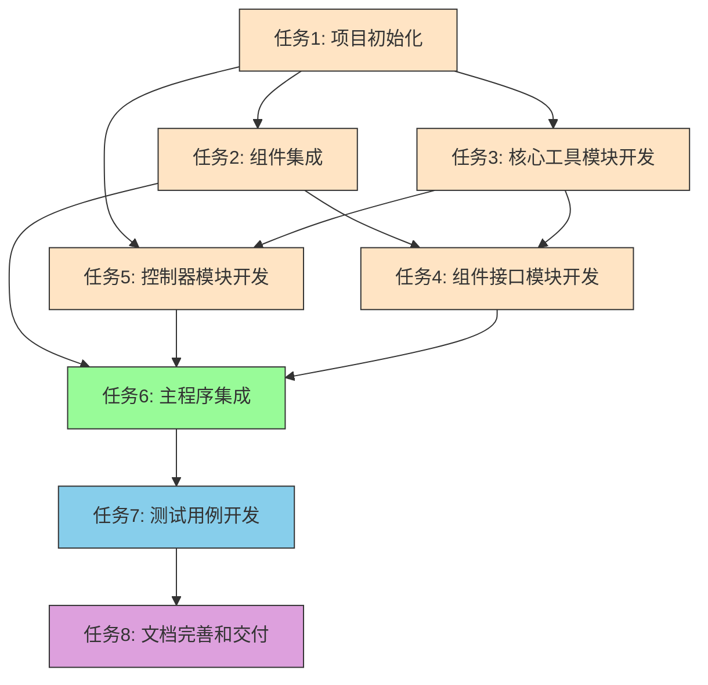

# 任务依赖关系图

## 依赖关系说明

1. **任务1** 是所有其他任务的基础，必须首先完成
2. **任务2** 依赖于任务1，负责集成所有第三方组件
3. **任务3** 和 **任务5** 可以并行开发，都依赖于任务1
4. **任务4** 需要任务2和任务3完成后才能进行
5. **任务6** 是集成任务，需要任务2、3、4、5全部完成后进行
6. **任务7** 是测试任务，在主程序完成后进行
7. **任务8** 是最后的文档完善任务，需要测试完成后进行

## 关键路径

项目的关键路径为：任务1 → 任务2 → 任务6 → 任务7 → 任务8
这条路径决定了项目的最短完成时间。