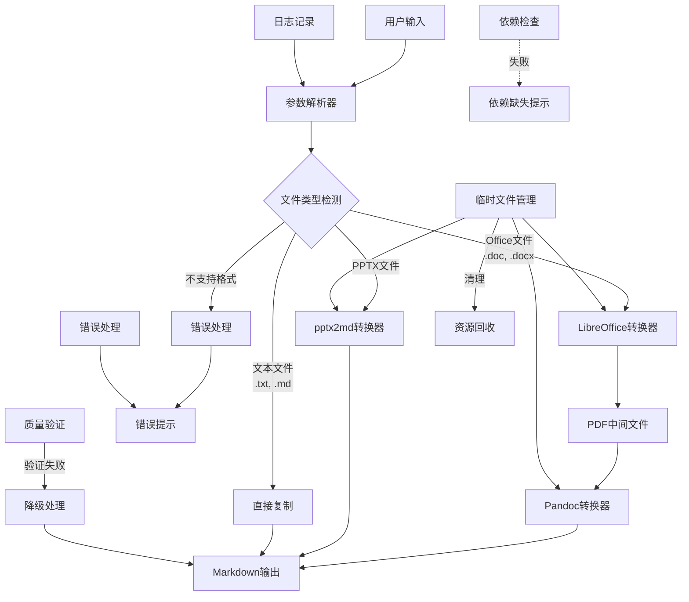
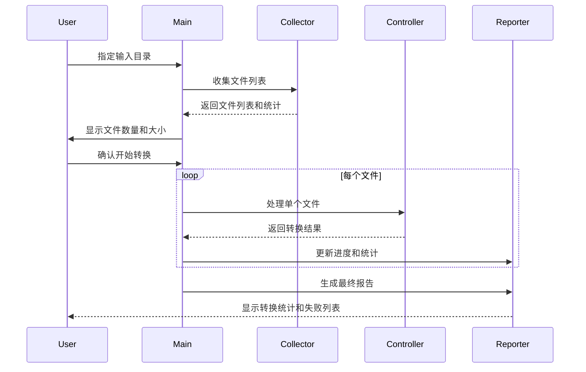

# Everything2MD 技术设计文档

## 1. 系统架构设计

### 1.1 整体架构


### 1.2 核心组件关系




#### 1.2.1 组件接口说明

**参数解析器**
- 接收用户输入的命令行参数
- 解析文件路径、输出路径和其他选项
- 验证参数的有效性

**文件类型检测**
- 根据文件扩展名判断文件类型
- 支持的类型：.doc, .docx, .pptx, .txt, .md
- 对不支持的格式触发错误处理流程

**LibreOffice转换器**
- 接收Office文档(.doc, .docx)作为输入
- 调用LibreOffice将文档转换为PDF格式
- 输出PDF中间文件供下一步处理

**pptx2md转换器**
- 专门处理.pptx文件
- 调用pptx2md库进行转换
- 直接输出Markdown格式

**Pandoc转换器**
- 接收PDF文件作为输入
- 调用Pandoc将PDF转换为Markdown
- 输出最终的Markdown文件

**直接复制**
- 处理.txt和.md文件
- 直接复制文件到输出位置
- 保持原有格式不变

#### 1.2.2 数据流向说明

1. **Office文档处理流程**：
   用户输入(.doc/.docx) → LibreOffice转换器(PDF) → Pandoc转换器(Markdown) → 输出

2. **PPTX文档处理流程**：
   用户输入(.pptx) → pptx2md转换器(Markdown) → 输出

3. **文本文件处理流程**：
   用户输入(.txt/.md) → 直接复制 → 输出

4. **错误处理流程**：
   不支持的格式 → 错误处理 → 错误提示

5. **依赖检查流程**：
   程序启动 → 依赖检查 → 依赖缺失提示(如有缺失)

6. **临时文件管理流程**：
   各转换器 → 临时文件管理 → 资源回收(转换完成后清理)

7. **质量验证流程**：
   转换输出 → 质量验证 → 降级处理(如验证失败) → 输出


## 2. 关键模块设计

### 2.1 转换控制器设计

#### 2.1.1 核心功能
- 协调各组件工作流程
- 处理转换路径选择
- 管理临时文件生命周期
- 实现错误处理和降级策略

#### 2.1.2 转换流程

**Office文档转换流程：**
```
输入验证 → 依赖检查 → 格式检测 → 路径选择 → 
组件调用 → 结果验证 → 错误处理 → 清理资源
```

**PPTX文档转换流程：**
```
输入验证 → 依赖检查 → 格式验证 → 
pptx2md调用 → 结果验证 → 错误处理
```

#### 2.1.3 错误处理策略

**分层错误处理：**
1. **输入层**：文件存在性、格式有效性验证
2. **依赖层**：组件可用性检查和安装指导
3. **转换层**：组件调用错误和异常处理
4. **输出层**：结果质量验证和降级处理

**降级策略：**
```bash
process_with_fallback() {
    local input_file="$1"
    local output_file="$2"
    
    # 尝试标准转换
    if process_standard_conversion "$input_file" "$output_file"; then
        if validate_output_quality "$output_file"; then
            return 0
        fi
    fi
    
    # 降级处理：提取纯文本
    log_warn "标准转换失败，尝试降级处理"
    if extract_text_content "$input_file" "$output_file"; then
        log_info "降级处理成功，输出纯文本格式"
        return 0
    fi
    
    return 1
}
```

### 2.2 组件接口设计

#### 2.2.1 LibreOffice接口

**功能：** 将Office文档转换为PDF格式

**接口定义：**
```bash
convert_office_to_pdf() {
    local input_file="$1"
    local output_dir="$2"
    
    # 输入验证
    validate_input_file "$input_file" || return 1
    
    # 依赖检查
    check_libreoffice || return 1
    
    # 执行转换（带超时和重试）
    local temp_log=$(mktemp)
    local result=1
    
    for attempt in {1..3}; do
        if timeout 60 libreoffice --headless --convert-to pdf \
            --outdir "$output_dir" "$input_file" > "$temp_log" 2>&1; then
            result=0
            break
        fi
        log_warn "LibreOffice 转换尝试 $attempt 失败，正在重试..."
        sleep 2
    done
    
    # 结果验证
    if [[ $result -eq 0 ]]; then
        validate_pdf_output "$output_dir" "$input_file"
    else
        log_error "LibreOffice 转换失败，日志: $(cat "$temp_log")"
    fi
    
    rm -f "$temp_log"
    return $result
}
```

**错误处理：**
- 输入文件格式验证
- LibreOffice可用性检查
- 转换超时处理（60秒）
- 重试机制（最多3次）
- 结果文件验证

#### 2.2.2 Pandoc接口修复

**问题分析：**
当前实现错误地使用 `-f html` 参数处理PDF文件：
```bash
# 错误实现
pandoc "$input_file" -f html -t markdown -o "$output_file" --wrap=none
```

**修复方案：**
```bash
convert_pdf_to_markdown() {
    local input_file="$1"
    local output_file="$2"
    
    # 输入验证
    validate_pdf_file "$input_file" || return 1
    
    # 依赖检查
    check_pandoc || return 1
    
    # 尝试使用Pandoc的PDF支持
    local temp_log=$(mktemp)
    local result=1
    
    # 方案1：尝试PDF解析
    if pandoc "$input_file" -f pdf -t markdown -o "$output_file" --wrap=none > "$temp_log" 2>&1; then
        # 验证输出质量
        if validate_output_quality "$output_file"; then
            result=0
        else
            log_warn "Pandoc PDF转换输出质量不佳"
        fi
    else
        log_warn "Pandoc PDF转换失败，尝试降级方案"
    fi
    
    # 方案2：降级处理（如果方案1失败）
    if [[ $result -ne 0 ]]; then
        if extract_text_from_pdf "$input_file" "$output_file"; then
            log_info "使用文本提取降级方案成功"
            result=0
        fi
    fi
    
    rm -f "$temp_log"
    return $result
}
```

#### 2.2.3 pptx2md接口优化

**功能增强：**
- 输入文件格式验证
- 错误处理和重试机制
- 输出质量检查
- 与其他组件接口一致性

**实现优化：**
```bash
convert_pptx_to_markdown() {
    local input_file="$1"
    local output_file="$2"
    
    # 输入验证
    validate_pptx_file "$input_file" || return 1
    
    # 依赖检查
    check_pptx2md || return 1
    
    # 执行转换
    local temp_log=$(mktemp)
    local result=1
    
    if pptx2md "$input_file" --output "$output_file" > "$temp_log" 2>&1; then
        # 验证输出
        if validate_output_quality "$output_file"; then
            result=0
        else
            log_warn "pptx2md转换输出质量不佳"
        fi
    else
        log_error "pptx2md转换失败: $(cat "$temp_log")"
    fi
    
    rm -f "$temp_log"
    return $result
}
```

### 2.3 依赖检查系统设计

#### 2.3.1 检查策略
- **预检机制**：程序启动前进行依赖检查
- **详细报告**：提供缺失组件列表和安装指导
- **平台适配**：支持不同操作系统的检测方式

#### 2.3.2 实现方案
```bash
#!/bin/bash
# dependency_checker.sh

check_all_dependencies() {
    local missing_deps=()
    local warnings=()
    
    # 检查 LibreOffice
    if ! command -v libreoffice &> /dev/null; then
        missing_deps+=("libreoffice")
    else
        # 验证版本和功能
        local version=$(libreoffice --version 2>/dev/null | head -1)
        log_info "LibreOffice版本: $version"
    fi
    
    # 检查 Pandoc
    if ! command -v pandoc &> /dev/null; then
        missing_deps+=("pandoc")
    else
        local version=$(pandoc --version 2>/dev/null | head -1)
        log_info "Pandoc版本: $version"
    fi
    
    # 检查 pptx2md
    if ! command -v pptx2md &> /dev/null; then
        missing_deps+=("pptx2md")
    else
        local version=$(pptx2md --version 2>/dev/null | head -1)
        log_info "pptx2md版本: $version"
    fi
    
    # 返回结果
    if [[ ${#missing_deps[@]} -gt 0 ]]; then
        show_install_instructions "${missing_deps[@]}"
        return 1
    fi
    
    log_info "所有依赖检查通过"
    return 0
}

show_install_instructions() {
    local missing_deps=("$@")
    
    echo "检测到以下依赖缺失，请安装后重试："
    echo ""
    
    for dep in "${missing_deps[@]}"; do
        case "$dep" in
            libreoffice)
                echo "📄 LibreOffice:"
                echo "  Ubuntu/Debian: sudo apt-get install libreoffice"
                echo "  macOS: brew install --cask libreoffice"
                echo "  CentOS: sudo yum install libreoffice"
                ;;
            pandoc)
                echo "📝 Pandoc:"
                echo "  Ubuntu/Debian: sudo apt-get install pandoc"
                echo "  macOS: brew install pandoc"
                echo "  CentOS: sudo yum install pandoc"
                ;;
            pptx2md)
                echo "📊 pptx2md:"
                echo "  pip install pptx2md"
                echo "  需要 Python 3.6+"
                ;;
        esac
        echo ""
    done
}
```

## 3. 批量转换架构

### 3.1 处理流程



### 3.2 文件收集策略

```bash
collect_files() {
    local input_dir="$1"
    local recursive="$2"
    local supported_extensions=("doc" "docx" "pptx")
    
    local find_cmd="find \"$input_dir\" -type f"
    
    # 构建扩展名过滤条件
    local ext_conditions=()
    for ext in "${supported_extensions[@]}"; do
        ext_conditions+=("-name \"*.$ext\"")
    done
    
    # 组合条件
    if [[ ${#ext_conditions[@]} -gt 1 ]]; then
        find_cmd+=" \( ${ext_conditions[0]}"
        for ((i=1; i<${#ext_conditions[@]}; i++)); do
            find_cmd+=" -o ${ext_conditions[i]}"
        done
        find_cmd+=" \)"
    else
        find_cmd+=" ${ext_conditions[0]}"
    fi
    
    # 递归选项
    if [[ "$recursive" != "true" ]]; then
        find_cmd+=" -maxdepth 1"
    fi
    
    # 执行查找
    eval "$find_cmd" | sort
}
```

### 3.3 进度和统计

```bash
process_batch_files() {
    local file_list=("$@")
    local total_count=${#file_list[@]}
    local success_count=0
    local failed_files=()
    local skipped_files=()
    
    log_info "开始批量转换，共 $total_count 个文件"
    
    for ((i=0; i<total_count; i++)); do
        local input_file="${file_list[i]}"
        local file_num=$((i + 1))
        
        # 显示进度
        printf "\r进度: %d/%d (%.1f%%)" "$file_num" "$total_count" "$(echo "scale=1; $file_num * 100 / $total_count" | bc -l)"
        
        # 处理文件
        local output_file=$(calculate_output_path "$input_file")
        
        if process_single_file "$input_file" "$output_file"; then
            ((success_count++))
        else
            failed_files+=("$input_file")
            log_error "转换失败: $input_file"
        fi
    done
    
    echo ""  # 换行
    
    # 生成报告
    generate_batch_report "$total_count" "$success_count" "${failed_files[@]}"
}

generate_batch_report() {
    local total="$1"
    local success="$2"
    shift 2
    local failed_files=("$@")
    local failed_count=${#failed_files[@]}
    local success_rate=$(echo "scale=1; $success * 100 / $total" | bc -l)
    
    echo "=================================="
    echo "批量转换完成报告"
    echo "=================================="
    echo "总文件数: $total"
    echo "成功: $success"
    echo "失败: $failed_count"
    echo "成功率: ${success_rate}%"
    echo "=================================="
    
    if [[ $failed_count -gt 0 ]]; then
        echo "失败文件列表:"
        for file in "${failed_files[@]}"; do
            echo "  - $file"
        done
        echo "=================================="
    fi
}
```

## 4. 错误处理和恢复机制

### 4.1 错误分类和处理

#### 4.1.1 输入错误
- **文件不存在**：检查路径并提供建议
- **格式不支持**：显示支持的格式列表
- **文件损坏**：尝试修复或建议重新获取

#### 4.1.2 依赖错误
- **组件未安装**：提供安装指导
- **版本不兼容**：显示推荐版本
- **权限不足**：提供权限解决方案

#### 4.1.3 转换错误
- **组件调用失败**：记录详细日志，提供重试
- **转换超时**：增加超时时间，分批处理
- **输出质量差**：降级处理，提取纯文本

### 4.2 恢复机制

```bash
# 错误处理框架
setup_error_handling() {
    # 设置错误陷阱
    trap 'handle_error $? $LINENO' ERR
    trap 'cleanup_on_exit' EXIT
    
    # 创建恢复点
    create_recovery_checkpoint
}

handle_error() {
    local exit_code="$1"
    local line_number="$2"
    local error_context=$(get_error_context)
    
    log_error "程序错误: 退出码=$exit_code, 行号=$line_number"
    log_error "错误上下文: $error_context"
    
    # 尝试恢复
    if [[ -f "$RECOVERY_CHECKPOINT" ]]; then
        if restore_from_checkpoint; then
            log_info "已从检查点恢复，继续执行"
            return 0
        fi
    fi
    
    # 无法恢复，清理退出
    cleanup_on_error
    exit $exit_code
}

# 具体的错误处理函数
handle_file_error() {
    local file_path="$1"
    local error_type="$2"
    
    case "$error_type" in
        "not_found")
            log_error "文件不存在: $file_path"
            suggest_similar_files "$file_path"
            ;;
        "not_readable")
            log_error "文件无法读取: $file_path"
            check_file_permissions "$file_path"
            ;;
        "unsupported_format")
            log_error "不支持的文件格式: $file_path"
            show_supported_formats
            ;;
        *)
            log_error "文件错误: $file_path (类型: $error_type)"
            ;;
    esac
}
```

## 5. 性能优化设计

### 5.1 内存管理
- **临时文件及时清理**：使用陷阱机制确保清理
- **大文件分块处理**：避免内存溢出
- **进程资源限制**：设置合理的资源上限

### 5.2 并发处理（可选）
```bash
# 并行处理实现
process_files_parallel() {
    local file_list=("$@")
    local max_jobs=4  # 根据CPU核心数调整
    
    log_info "使用并行处理，最大作业数: $max_jobs"
    
    # 使用GNU parallel或xargs
    printf '%s\n' "${file_list[@]}" | \
    xargs -P "$max_jobs" -I {} bash -c '
        input_file="{}"
        output_file="${input_file%.*}.md"
        
        if process_single_file "$input_file" "$output_file"; then
            echo "SUCCESS: $input_file"
        else
            echo "FAILED: $input_file" >&2
        fi
    ' | while IFS= read -r line; do
        if [[ "$line" == SUCCESS:* ]]; then
            ((success_count++))
        elif [[ "$line" == FAILED:* ]]; then
            failed_files+=("${line#FAILED: }")
        fi
        
        # 更新进度显示
        show_progress "$success_count" "$total_count"
    done
}
```

## 6. 质量保证机制

### 6.1 输出质量验证
```bash
validate_conversion_quality() {
    local input_file="$1"
    local output_file="$2"
    local min_quality_score=60
    
    # 多维度质量检查
    local checks=(
        "check_file_exists:$output_file"
        "check_min_size:$output_file:100"  # 最小100字节
        "check_content_validity:$output_file"
        "check_structure_integrity:$output_file"
    )
    
    local quality_score=0
    local total_checks=${#checks[@]}
    
    for check in "${checks[@]}"; do
        IFS=':' read -r check_type check_args <<< "$check"
        
        if perform_quality_check "$check_type" "$check_args"; then
            ((quality_score += 100 / total_checks))
        fi
    done
    
    if [[ $quality_score -ge $min_quality_score ]]; then
        log_info "质量检查通过: ${quality_score}%"
        return 0
    else
        log_warn "质量检查未通过: ${quality_score}% (要求: ${min_quality_score}%)"
        return 1
    fi
}
```

### 6.2 测试策略
- **单元测试**：每个模块独立测试
- **集成测试**：模块间协作测试
- **端到端测试**：完整流程测试
- **性能测试**：大文件和批量处理测试
- **兼容性测试**：不同平台和组件版本测试

这个技术设计文档提供了完整的系统架构、详细的实现方案和全面的质量保证机制，为项目的稳定实现提供了坚实的技术基础。