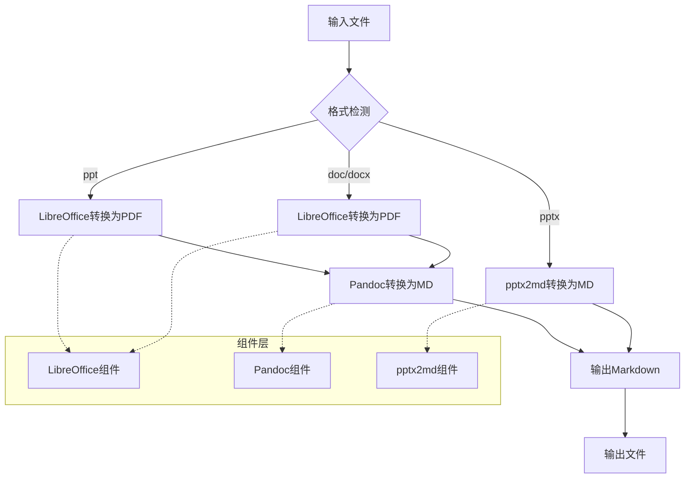
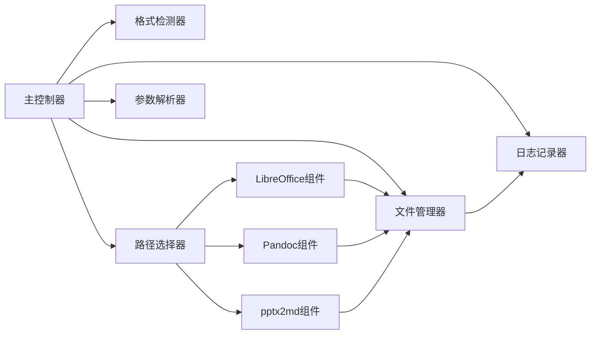
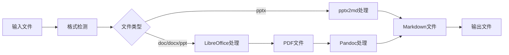

# DESIGN: Everything2MD 文档转换项目

## 1. 整体架构图



## 2. 分层设计和核心组件

### 应用层
- **主控制器**：负责接收输入参数、调用格式检测、选择转换路径、执行转换流程
- **格式检测器**：根据文件扩展名确定文件类型
- **路径选择器**：根据文件类型选择合适的转换路径

### 组件层
- **LibreOffice组件**：处理doc/docx/ppt到pdf的转换
- **Pandoc组件**：处理pdf到markdown的转换
- **pptx2md组件**：处理pptx到markdown的转换

### 工具层
- **文件管理器**：处理临时文件的创建、使用和清理
- **日志记录器**：记录转换过程中的关键信息和错误
- **参数解析器**：解析命令行参数

## 3. 模块依赖关系图



## 4. 接口契约定义

### 主程序接口
```bash
everything2md.sh [-h] [-b] [-v] input [output]

参数:
  input          输入文件或目录路径
  output         输出文件或目录路径（可选）
  -h, --help     显示帮助信息
  -b, --batch    批量转换模式
  -v, --verbose  详细输出模式
```

### 组件接口

#### LibreOffice 组件接口
```bash
libreoffice --headless --convert-to pdf [--outdir output_dir] input_file
```

#### Pandoc 组件接口
```bash
pandoc -f pdf -t markdown input_file -o output_file
```

#### pptx2md 组件接口
```bash
pptx2md input_file [--output output_file]
```

## 5. 数据流向图



## 6. 异常处理策略

### 错误分类
1. **输入错误**：文件不存在、格式不支持等
2. **组件错误**：组件未安装、组件执行失败等
3. **系统错误**：磁盘空间不足、权限不足等

### 处理策略
1. **输入错误**：提供清晰的错误信息和使用帮助
2. **组件错误**：记录详细日志，尝试备用方案或退出
3. **系统错误**：记录日志并安全退出

### 日志级别
- **INFO**：记录关键步骤和状态
- **WARN**：记录可恢复的异常情况
- **ERROR**：记录严重错误并终止程序

## 7. 项目目录结构

```
Everything2MD/
├── README.md
├── everything2md.sh                 # 主程序入口
├── docs/
│   └── everything2md/
│       ├── ALIGNMENT_everything2md.md
│       ├── CONSENSUS_everything2md.md
│       ├── DESIGN_everything2md.md
│       ├── TASK_everything2md.md
│       ├── ACCEPTANCE_everything2md.md
│       └── FINAL_everything2md.md
├── src/
│   ├── core/
│   │   ├── detector.sh              # 格式检测器
│   │   ├── router.sh                # 路径选择器
│   │   └── file_manager.sh          # 文件管理器
│   ├── components/
│   │   ├── libreoffice.sh           # LibreOffice接口
│   │   ├── pandoc.sh                # Pandoc接口
│   │   └── pptx2md.sh               # pptx2md接口
│   ├── utils/
│   │   ├── logger.sh                # 日志记录器
│   │   └── parser.sh                # 参数解析器
│   └── main.sh                      # 主控制器
├── tests/
│   ├── test.sh                      # 测试入口
│   ├── fixtures/                    # 测试文件
│   └── expected/                    # 期望结果
└── components/                      # 第三方组件
    ├── libreoffice/
    ├── pandoc/
    └── pptx2md/
```