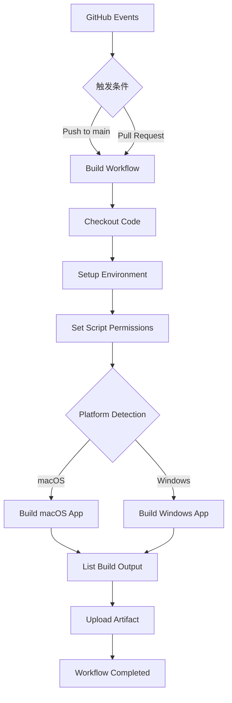
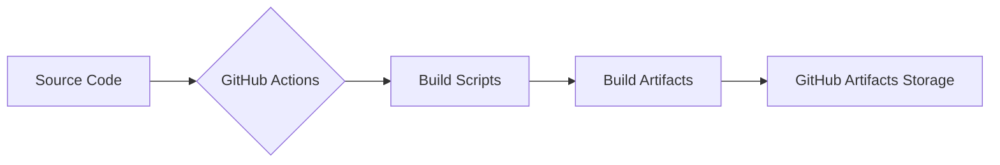

# GitHub Actions 打包工作流 - 设计文档

## 整体架构图



## 分层设计

### 触发层
- Push事件：当代码推送到main分支时触发
- Pull Request事件：当向main分支发起PR时触发

### 执行层
- 环境准备：检出代码、设置环境变量
- 构建执行：根据目标平台调用相应的构建命令
- 产物处理：列出构建产物、上传为artifact

### 平台适配层
- macOS适配：使用macos-latest运行器
- Windows适配：使用windows-latest运行器

## 核心组件

1. **触发器**：定义工作流的触发条件
2. **作业(job)**：定义工作流中的执行单元
3. **步骤(step)**：定义作业中的具体执行步骤
4. **动作(action)**：使用预定义的GitHub Actions功能

## 模块依赖关系

```mermaid
graph LR
    A[build-macos.yml] --> B[actions/checkout@v3]
    A --> C[chmod build.sh]
    A --> D[./build.sh -p macos]
    A --> E[actions/upload-artifact@v3]
    
    F[build-windows.yml] --> B
    F --> C
    F --> G[./build.sh -p windows]
    F --> E
```

## 接口契约定义

### 输入契约
- GitHub事件（push/PR）
- 代码仓库访问权限
- 运行器环境（macOS/Windows）

### 输出契约
- 构建成功的状态码
- 上传到GitHub的artifact
- 构建日志输出

## 数据流向图



## 异常处理策略

1. **构建失败**：工作流会显示失败状态，提供详细的错误日志
2. **权限问题**：确保build.sh脚本具有执行权限
3. **环境问题**：使用GitHub提供的标准运行器环境
4. **网络问题**：GitHub Actions会自动重试网络相关的操作