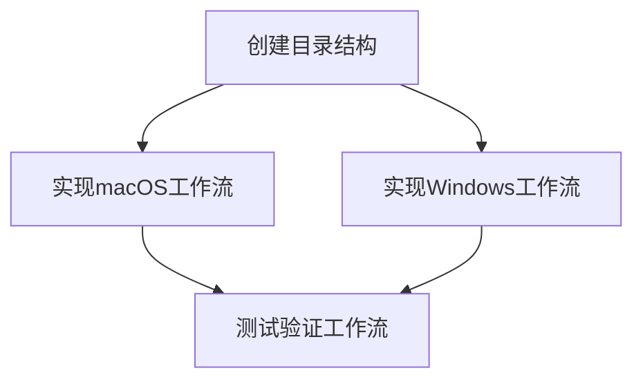

# GitHub Actions 打包工作流 - 原子化任务文档

## 任务拆分

### 任务1: 创建GitHub Actions工作流目录结构

**输入契约:**
- 项目根目录访问权限
- 文件系统写入权限

**输出契约:**
- 创建.github/workflows目录
- 目录结构符合GitHub Actions要求

**实现约束:**
- 使用标准的mkdir命令
- 确保目录权限正确

**依赖关系:**
- 无前置任务
- 后置任务：任务2、任务3

### 任务2: 实现macOS应用打包工作流

**输入契约:**
- 项目代码已检出
- build.sh脚本可用
- macOS运行环境

**输出契约:**
- build-macos.yml文件
- 能够在macOS运行器上成功执行
- 生成macOS构建产物

**实现约束:**
- 使用macos-latest运行器
- 正确设置脚本执行权限
- 上传构建产物为artifact

**依赖关系:**
- 前置任务：任务1
- 后置任务：任务4

### 任务3: 实现Windows应用打包工作流

**输入契约:**
- 项目代码已检出
- build.sh脚本可用
- Windows运行环境

**输出契约:**
- build-windows.yml文件
- 能够在Windows运行器上成功执行
- 生成Windows构建产物

**实现约束:**
- 使用windows-latest运行器
- 正确设置脚本执行权限
- 处理Windows平台的路径差异
- 上传构建产物为artifact

**依赖关系:**
- 前置任务：任务1
- 后置任务：任务4

### 任务4: 测试和验证工作流功能

**输入契约:**
- 完成的任务2和任务3
- GitHub仓库访问权限

**输出契约:**
- 工作流能够成功运行
- 构建产物正确生成
- artifact能够正常上传和下载

**实现约束:**
- 在实际GitHub环境中测试
- 验证两个平台的构建产物
- 检查构建日志是否正常

**依赖关系:**
- 前置任务：任务2、任务3
- 无后置任务

## 任务依赖图

## 验收标准

1. 目录结构正确创建
2. macOS工作流文件符合语法规范
3. Windows工作流文件符合语法规范
4. 两个工作流都能在GitHub Actions中成功运行
5. 构建产物正确生成并上传