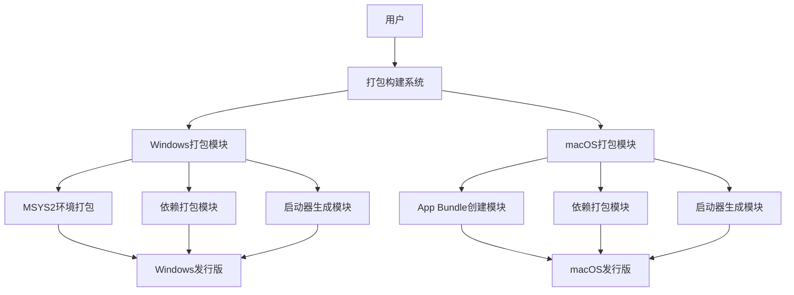
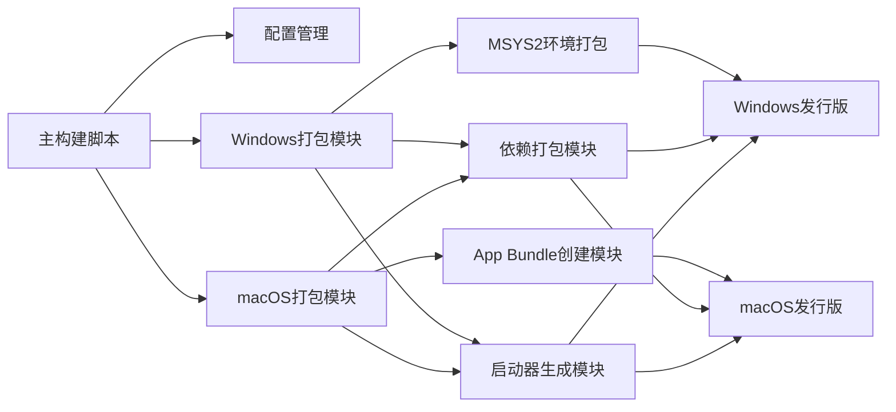
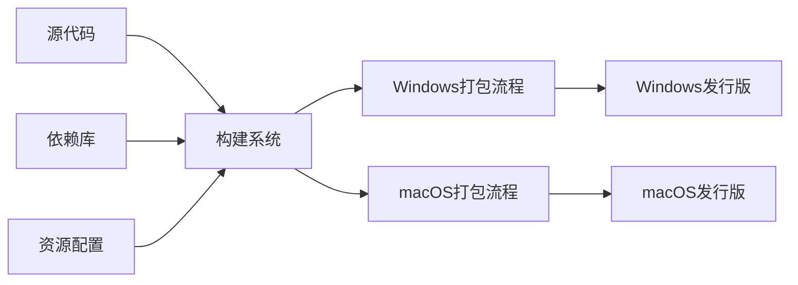

# 打包任务架构设计文档

## 整体架构图



## 分层设计和核心组件

### 1. 构建系统层
- **主构建脚本**: 统一入口，负责调用各平台打包模块
- **配置管理**: 管理各平台的打包配置和元数据
- **依赖分析**: 分析项目依赖并生成依赖清单

### 2. 平台适配层
- **Windows打包模块**: 处理Windows平台特定的打包逻辑
- **macOS打包模块**: 处理macOS平台特定的打包逻辑

### 3. 核心组件层
- **依赖打包模块**: 负责将项目依赖打包进发行版
- **启动器生成模块**: 生成各平台的启动器程序
- **资源处理模块**: 处理图标、文档等资源文件

## 模块依赖关系图



## 接口契约定义

### 1. 主构建脚本接口
```bash
# 构建Windows版本
build_windows() {
    # 参数: 输出目录
    # 返回: 0成功，非0失败
}

# 构建macOS版本
build_macos() {
    # 参数: 输出目录
    # 返回: 0成功，非0失败
}
```

### 2. Windows打包模块接口
```bash
# 创建MSYS2环境
create_msys2_env() {
    # 参数: 目标目录
    # 返回: 0成功，非0失败
}

# 打包依赖项
package_windows_deps() {
    # 参数: 源目录, 目标目录
    # 返回: 0成功，非0失败
}
```

### 3. macOS打包模块接口
```bash
# 创建App Bundle结构
create_app_bundle() {
    # 参数: 应用名称, 目标目录
    # 返回: 0成功，非0失败
}

# 打包依赖项
package_macos_deps() {
    # 参数: 源目录, 目标目录
    # 返回: 0成功，非0失败
}
```

## 数据流向图



## 异常处理策略

### 1. 依赖缺失处理
- 检测构建所需依赖是否安装
- 提供清晰的错误信息和安装指导
- 支持跳过非关键依赖继续构建

### 2. 打包失败处理
- 记录详细的错误日志
- 清理临时文件和部分构建产物
- 提供恢复机制重新开始构建

### 3. 平台兼容性处理
- 检测目标平台的版本兼容性
- 提供平台特定的错误处理逻辑
- 支持跨平台构建（在macOS上构建Windows版本等）

## 设计原则

### 1. 严格遵循任务范围
- 仅实现Windows和macOS平台的打包功能
- 不引入与打包无关的功能
- 保持现有代码逻辑不变

### 2. 确保与现有系统架构一致
- 遵循项目现有的模块化设计
- 使用相同的代码风格和注释规范
- 保持与现有构建流程的兼容性

### 3. 复用现有组件和模式
- 复用项目的配置管理模块
- 使用项目现有的日志记录机制
- 遵循项目现有的错误处理模式