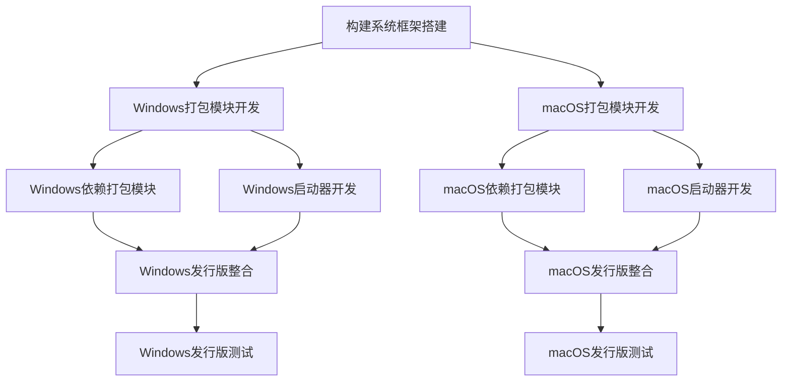

# 打包任务原子化分解

## 任务1: 构建系统框架搭建

### 输入契约
- 前置依赖: 项目源代码
- 输入数据: Everything2MD项目源码
- 环境依赖: Bash环境

### 输出契约
- 输出数据: 构建系统基础框架
- 交付物: 
  1. 主构建脚本(build.sh)
  2. 配置文件模板
  3. 构建目录结构
- 验收标准: 能够运行主构建脚本并显示帮助信息

### 实现约束
- 使用Bash脚本实现
- 遵循项目现有代码规范
- 支持Windows和macOS平台检测

### 依赖关系
- 后置任务: Windows打包模块开发, macOS打包模块开发
- 并行任务: 无

## 任务2: Windows打包模块开发

### 输入契约
- 前置依赖: 构建系统框架
- 输入数据: Everything2MD项目源码, Windows平台依赖列表
- 环境依赖: Windows系统或交叉编译环境

### 输出契约
- 输出数据: Windows平台打包功能
- 交付物:
  1. Windows打包脚本(windows_packager.sh)
  2. MSYS2环境集成脚本
  3. Windows启动器源码
- 验收标准: 能够生成可运行的Windows发行版

### 实现约束
- 必须集成所有依赖项(LibreOffice, Pandoc, pptx2md)
- 生成的exe文件应能独立运行
- 支持命令行参数传递

### 依赖关系
- 前置任务: 构建系统框架搭建
- 后置任务: Windows依赖打包, Windows启动器开发
- 并行任务: macOS打包模块开发

## 任务3: macOS打包模块开发

### 输入契约
- 前置依赖: 构建系统框架
- 输入数据: Everything2MD项目源码, macOS平台依赖列表
- 环境依赖: macOS系统

### 输出契约
- 输出数据: macOS平台打包功能
- 交付物:
  1. macOS打包脚本(macos_packager.sh)
  2. App Bundle创建脚本
  3. macOS启动器源码
- 验收标准: 能够生成可运行的macOS发行版

### 实现约束
- 必须符合macOS App Bundle规范
- 生成的.app文件应能独立运行
- 支持命令行参数传递

### 依赖关系
- 前置任务: 构建系统框架搭建
- 后置任务: macOS依赖打包, macOS启动器开发
- 并行任务: Windows打包模块开发

## 任务4: Windows依赖打包模块

### 输入契约
- 前置依赖: Windows打包模块开发
- 输入数据: Windows平台依赖项(LibreOffice, Pandoc, pptx2md)
- 环境依赖: Windows系统, MSYS2环境

### 输出契约
- 输出数据: 打包好的Windows依赖项
- 交付物:
  1. Windows依赖打包脚本
  2. 依赖项清单文件
  3. 打包好的依赖目录结构
- 验收标准: 所有依赖项能被正确打包并在Windows环境中运行

### 实现约束
- 依赖项必须能在打包后的环境中正常运行
- 保持依赖项的相对路径关系
- 处理依赖项之间的相互引用

### 依赖关系
- 前置任务: Windows打包模块开发
- 后置任务: Windows发行版整合
- 并行任务: macOS依赖打包模块

## 任务5: macOS依赖打包模块

### 输入契约
- 前置依赖: macOS打包模块开发
- 输入数据: macOS平台依赖项(LibreOffice, Pandoc, pptx2md)
- 环境依赖: macOS系统

### 输出契约
- 输出数据: 打包好的macOS依赖项
- 交付物:
  1. macOS依赖打包脚本
  2. 依赖项清单文件
  3. 打包好的依赖目录结构
- 验收标准: 所有依赖项能被正确打包并在macOS环境中运行

### 实现约束
- 依赖项必须能在打包后的环境中正常运行
- 符合macOS应用程序的沙盒机制
- 处理依赖项的代码签名问题

### 依赖关系
- 前置任务: macOS打包模块开发
- 后置任务: macOS发行版整合
- 并行任务: Windows依赖打包模块

## 任务6: Windows启动器开发

### 输入契约
- 前置依赖: Windows打包模块开发
- 输入数据: Windows平台API, 启动器需求规格
- 环境依赖: Windows开发环境(C/C++编译器)

### 输出契约
- 输出数据: Windows平台启动器程序
- 交付物:
  1. Windows启动器源码(.c/.cpp)
  2. 编译脚本
  3. 编译好的exe启动器
- 验收标准: 启动器能够正确启动内部的Bash环境并传参

### 实现约束
- 启动器必须是原生Windows程序
- 启动器大小应尽可能小
- 支持Unicode字符集

### 依赖关系
- 前置任务: Windows打包模块开发
- 后置任务: Windows发行版整合
- 并行任务: macOS启动器开发

## 任务7: macOS启动器开发

### 输入契约
- 前置依赖: macOS打包模块开发
- 输入数据: macOS平台API, 启动器需求规格
- 环境依赖: macOS开发环境(Xcode/Clang)

### 输出契约
- 输出数据: macOS平台启动器程序
- 交付物:
  1. macOS启动器源码(.m/.swift)
  2. 编译脚本
  3. 编译好的启动器二进制文件
- 验收标准: 启动器能够正确启动内部的脚本并传参

### 实现约束
- 启动器必须符合macOS应用程序规范
- 支持从Finder和终端两种方式启动
- 处理应用程序权限问题

### 依赖关系
- 前置任务: macOS打包模块开发
- 后置任务: macOS发行版整合
- 并行任务: Windows启动器开发

## 任务8: Windows发行版整合

### 输入契约
- 前置依赖: Windows依赖打包, Windows启动器开发
- 输入数据: Windows打包产物, 依赖项, 启动器
- 环境依赖: Windows系统

### 输出契约
- 输出数据: 完整的Windows发行版
- 交付物:
  1. 完整的Windows发行版目录结构
  2. 安装脚本
  3. 发行版压缩包
- 验收标准: 发行版能够在干净的Windows系统上独立运行

### 实现约束
- 保持所有文件的相对路径关系
- 提供简单的安装和卸载功能
- 包含必要的使用文档

### 依赖关系
- 前置任务: Windows依赖打包模块, Windows启动器开发
- 后置任务: Windows发行版测试
- 并行任务: macOS发行版整合

## 任务9: macOS发行版整合

### 输入契约
- 前置依赖: macOS依赖打包, macOS启动器开发
- 输入数据: macOS打包产物, 依赖项, 启动器
- 环境依赖: macOS系统

### 输出契约
- 输出数据: 完整的macOS发行版
- 交付物:
  1. 完整的macOS App Bundle
  2. 安装脚本
  3. 发行版磁盘映像(.dmg)
- 验收标准: 发行版能够在干净的macOS系统上独立运行

### 实现约束
- 符合macOS App Bundle规范
- 提供拖拽安装功能
- 包含必要的使用文档

### 依赖关系
- 前置任务: macOS依赖打包模块, macOS启动器开发
- 后置任务: macOS发行版测试
- 并行任务: Windows发行版整合

## 任务10: Windows发行版测试

### 输入契约
- 前置依赖: Windows发行版整合
- 输入数据: Windows发行版压缩包
- 环境依赖: 干净的Windows 10/11系统

### 输出契约
- 输出数据: 测试报告
- 交付物:
  1. Windows平台测试报告
  2. Bug清单(如有)
  3. 性能测试结果
- 验收标准: 所有功能正常运行，性能符合预期

### 实现约束
- 在多种Windows版本上测试
- 验证所有支持的文件格式转换功能
- 测试命令行参数传递功能

### 依赖关系
- 前置任务: Windows发行版整合
- 后置任务: 无
- 并行任务: macOS发行版测试

## 任务11: macOS发行版测试

### 输入契约
- 前置依赖: macOS发行版整合
- 输入数据: macOS App Bundle
- 环境依赖: 干净的macOS系统(10.15+)

### 输出契约
- 输出数据: 测试报告
- 交付物:
  1. macOS平台测试报告
  2. Bug清单(如有)
  3. 性能测试结果
- 验收标准: 所有功能正常运行，性能符合预期

### 实现约束
- 在多种macOS版本上测试
- 验证所有支持的文件格式转换功能
- 测试命令行参数传递功能

### 依赖关系
- 前置任务: macOS发行版整合
- 后置任务: 无
- 并行任务: Windows发行版测试

## 任务依赖关系图

