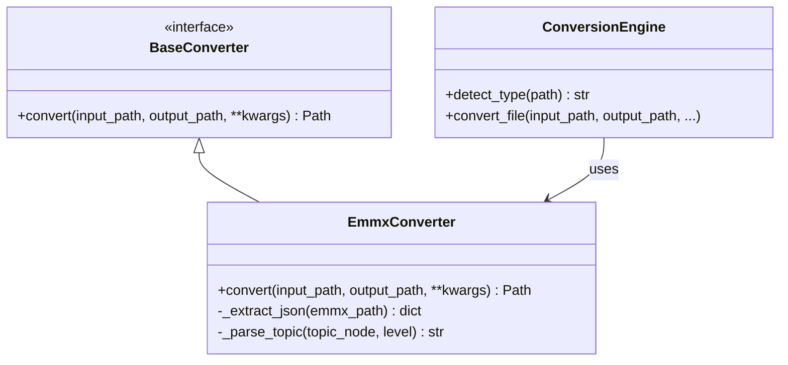

# DESIGN: 增加 emmx 格式兼容

## 1. 整体架构
本任务遵循现有架构，通过扩展 `BaseConverter` 实现新的 `EmmxConverter`，并在 `ConversionEngine` 中注册。

## 2. 模块设计
### 2.1 EmmxConverter (`src/core/converters/emmx.py`)
- **职责**: 解析 .emmx 文件并生成 Markdown。
- **关键方法**:
  - `convert`: 主入口，处理文件读写。
  - `_extract_json`: 使用 `zipfile` 读取 `doc/document.json`。如果失败，尝试 `mindmap.json`。
  - `_parse_topic`: 递归函数，将 JSON 节点转换为 Markdown 字符串。
    - 输入: `node` (dict), `level` (int)
    - 输出: Markdown 字符串
    - 逻辑: 
      - 获取标题 `title` 或 `text`。
      - 生成当前行的 Markdown (例如 `  ` * level + `- ` + title)。
      - 递归处理 `children` 或 `topics`。

### 2.2 ConversionEngine (`src/core/engine.py`)
- **修改**:
  - 引入 `EmmxConverter`。
  - `detect_type`: 增加 `elif suffix == '.emmx': return 'emmx'`。
  - `convert_file`: 增加 `elif file_type == 'emmx': final_path = self.emmx_converter.convert(...)`。

## 3. 接口契约
- **输入**: `.emmx` 文件路径 (pathlib.Path)。
- **输出**: `.md` 文件路径 (pathlib.Path)。
- **异常**: 如果是非法 emmx 文件，抛出 `ValueError` 或 `zipfile.BadZipFile`，由 Engine 捕获并记录日志。

## 4. 数据流向
User -> GUI -> ConversionEngine -> detect_type('emmx') -> EmmxConverter -> zipfile -> JSON -> Markdown -> Disk

## 5. 异常处理策略
- 文件损坏: 捕获 `zipfile.BadZipFile`，记录 "文件已损坏或不是有效的 emmx 文件"。
- 结构不匹配: 捕获 `KeyError`，记录 "未知的 emmx 内部结构"。
