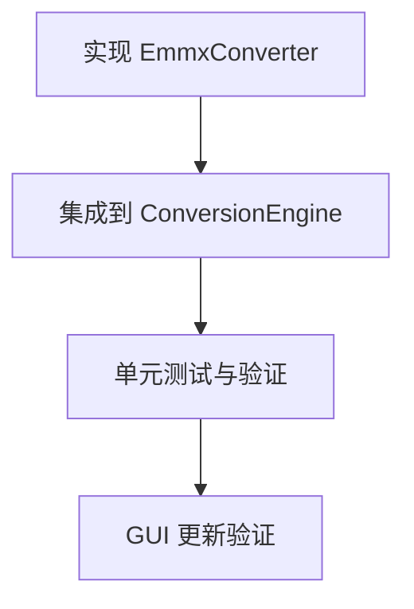

# TASK: 增加 emmx 格式兼容

## 任务依赖图

## 原子任务列表

### Task 1: 实现 EmmxConverter
- **目标**: 创建 `src/core/converters/emmx.py`。
- **输入**: 无。
- **输出**: 完成的 `EmmxConverter` 类。
- **步骤**:
  1. 创建文件。
  2. 实现 `_extract_json` 逻辑，支持 `doc/document.json` 和 `mindmap.json`。
  3. 实现 `_parse_topic` 递归逻辑。
  4. 实现 `convert` 接口。
- **验收标准**: 能正确解析示例 emmx 结构（模拟数据）并生成 Markdown 字符串。

### Task 2: 集成到 ConversionEngine
- **目标**: 修改 `src/core/engine.py`。
- **输入**: 完成的 `EmmxConverter`。
- **输出**: 更新后的 `ConversionEngine`。
- **步骤**:
  1. 导入 `EmmxConverter`。
  2. 初始化实例。
  3. 更新 `detect_type`。
  4. 更新 `convert_file`。
- **验收标准**: `detect_type` 能识别 `.emmx`，`convert_file` 能调用 `EmmxConverter`。

### Task 3: 单元测试与验证
- **目标**: 验证转换逻辑。
- **输入**: 模拟的 emmx 文件（通过 zipfile 创建）。
- **输出**: 测试报告。
- **步骤**:
  1. 创建 `tests/test_emmx.py`。
  2. 构造一个包含 `doc/document.json` 的 zip 文件。
  3. 调用 `EmmxConverter.convert`。
  4. 验证输出的 Markdown 内容是否符合预期。
- **验收标准**: 测试通过。

### Task 4: GUI 更新验证
- **目标**: 确保 GUI 能选择 .emmx 文件。
- **输入**: 运行 GUI。
- **输出**: 无代码修改（如果 GUI 使用通用的文件选择器），或者修改 GUI 过滤器。
- **备注**: 根据 `src/gui/main.py` 的代码，如果文件过滤器是硬编码的，则需要修改。
- **步骤**:
  1. 检查 `src/gui/main.py` 的文件过滤器。
  2. 如果需要，添加 `*.emmx`。
- **验收标准**: GUI 文件选择器显示 .emmx 文件。
