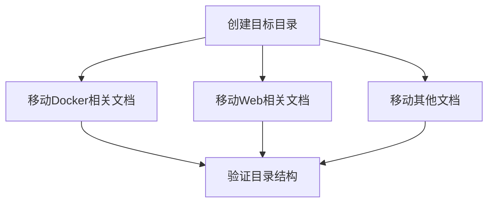

# TASK: 文档整理任务分解

## 依赖图

## 原子任务列表

### Task 1: 创建目录结构
- **Input**: 无
- **Output**: 新建文件夹 `docs/03_维护与修复/Docker修复`, `docs/03_维护与修复/Web界面修复`, `docs/05_部署发布`
- **Command**: `mkdir`

### Task 2: 移动 Docker 文档
- **Action**: 
  - Move `Docker资源本地缓存` -> `02_功能模块/Docker服务/`
  - Move `执行Dockerfile指引` -> `02_功能模块/Docker服务/`
  - Move `Docker构建修复` -> `03_维护与修复/Docker修复/`
  - Move `Docker适配修复` -> `03_维护与修复/Docker修复/`
  - Move `Docker镜像构建修复` -> `03_维护与修复/Docker修复/`
  - Move `Docker页面访问修复` -> `03_维护与修复/Docker修复/`

### Task 3: 移动 Web 文档
- **Action**:
  - Move `Web文件选择器优化及全盘访问` -> `02_功能模块/Web界面/`
  - Move `Web端文件选择器适配` -> `02_功能模块/Web界面/`
  - Move `界面优化_中文及原生文件选择` -> `02_功能模块/Web界面/`
  - Move `Web文件选择器故障排查` -> `03_维护与修复/Web界面修复/`
  - Move `修复文件选择组件` -> `03_维护与修复/Web界面修复/`

### Task 4: 移动其他文档
- **Action**:
  - Move `环境配置修复` -> `03_维护与修复/`
  - Move `构建测试体系` -> `04_测试/`
  - Move `打包项目为exe` -> `05_部署发布/`

### Task 5: 验证
- **Check**: 确认原路径不存在，新路径存在。
