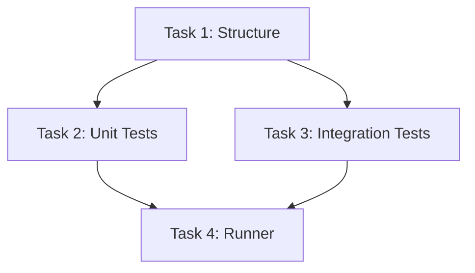

# TASK: 构建完善的测试体系

## 1. 任务拆解

### Task 1: 目录重构与配置
- **目标**: 建立规范的 `pytest` 目录结构。
- **子任务**:
    - [ ] 创建 `test/unit/core` 和 `test/unit/gui` 目录。
    - [ ] 移动现有的 `test_ragflow_client.py` 到 `test/unit/core`。
    - [ ] 移动 `test/python/*.py` 到 `test/unit/gui` (如果适用) 或 `test/integration`。
    - [ ] 创建 `test/conftest.py`。
    - [ ] 创建 `pytest.ini`。

### Task 2: 核心单元测试实现
- **目标**: 覆盖 `src/core`。
- **子任务**:
    - [ ] 编写 `test/unit/core/test_config.py`: 测试 `ConfigManager`。
    - [ ] 编写 `test/unit/core/test_engine.py`: 测试 `ConversionEngine` (逻辑部分，不调用外部命令)。
    - [ ] 编写 `test/unit/core/test_utils.py`: 测试工具函数。

### Task 3: 集成测试实现
- **目标**: 验证端到端流程。
- **子任务**:
    - [ ] 编写 `test/integration/test_conversion_flow.py`: 使用简单的 `.txt` 文件测试从输入到输出的完整流程。

### Task 4: 运行脚本与验证
- **目标**: 提供便捷的运行方式。
- **子任务**:
    - [ ] 编写 `run_tests.py`。
    - [ ] 运行所有测试并修复发现的 Bug。
    - [ ] 记录覆盖率报告。

## 2. 依赖图

