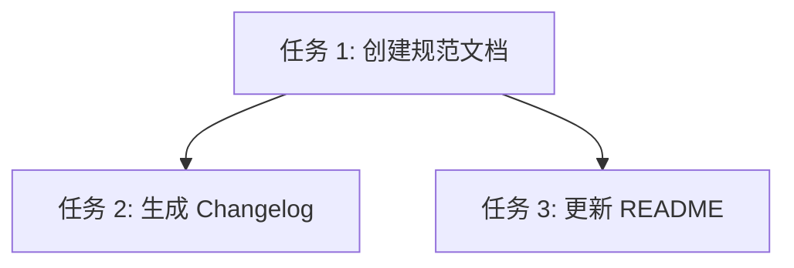

# TASK: 版本管理规范与历史记录

## 1. 任务清单

### 任务 1: 创建版本管理规范文档
- **目标**: 创建 `docs/rules/VERSIONING.md`。
- **输入**: CONSENSUS 文档中的规范草案。
- **输出**: 完整的规范文档。
- **依赖**: 无。

### 任务 2: 生成版本变更日志
- **目标**: 创建 `CHANGELOG.md`。
- **输入**: CONSENSUS 文档中的版本历史划分。
- **输出**: 格式化的 `CHANGELOG.md` 文件。
- **依赖**: 任务 1 (格式需符合规范)。

### 任务 3: 更新项目说明文档
- **目标**: 更新 `README.md`。
- **输入**: `docs/rules/VERSIONING.md` 的路径。
- **输出**: 包含规范链接的 `README.md`。
- **依赖**: 任务 1。

## 2. 依赖图 (Mermaid)

